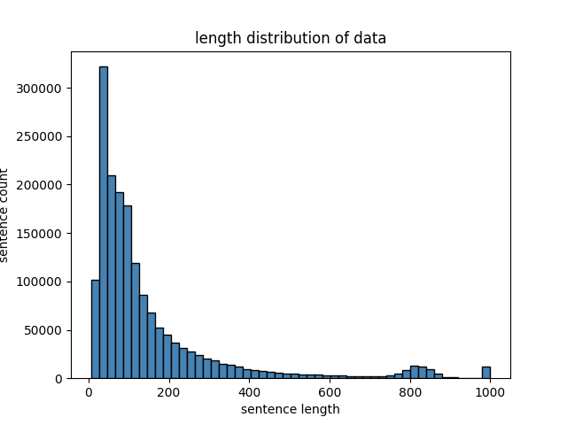

#   Firefly(流萤): 中文对话式大语言模型


## 项目简介
**Firefly（流萤）** 是一个开源的中文对话式大语言模型，使用指令微调（Instruction Tuning）在中文数据集上进行调优。同时使用了词表裁剪、ZeRO、张量并行等技术，有效降低显存消耗和提高训练效率。
在训练中，我们使用了更小的模型参数量，以及更少的计算资源。

我们构造了许多与中华文化相关的数据，以提升模型这方面的表现，如对联、作诗、文言文翻译、散文、金庸小说等。

**流萤**（萤火虫的别称）是中华传统文化的一个符号，虽说腐草为萤，带有悲悯意味，但萤火虽小，也能凭借其淡淡荧光，照亮夜空。本项目的名称取自杜牧的《秋夕》：**银烛秋光冷画屏，轻罗小扇扑流萤**。
也希望本项目能够像流萤一般发出淡淡微光，为中文NLP开源社区尽绵薄之力，添砖加瓦。
```text
《咏萤火》 
 唐.李白
雨打灯难灭，
风吹色更明。
若飞天上去，
定作月边星。
```

主要工作如下：
- **数据集**：[firefly-train-1.1M](https://huggingface.co/datasets/YeungNLP/firefly-train-1.1M) ， 一份高质量的包含1.1M中文多任务指令微调数据集，包含23种常见的中文NLP任务的指令数据。对于每个任务，由人工书写若干指令模板，保证数据的高质量与丰富度。
- **模型裁剪**：[LLMPruner：大语言模型裁剪工具](https://github.com/yangjianxin1/LLMPruner) ，使用词表裁剪技术对多语种大语言模型进行权重裁剪，保留预训练知识的前提下，有效减少模型参数量，提高训练效率，并分享裁剪后的多种参数规模的Bloom模型权重。
- **权重分享**：在[bloom-1b4-zh](https://huggingface.co/YeungNLP/bloom-1b4-zh) 和[bloom-2b6-zh](https://huggingface.co/YeungNLP/bloom-2b6-zh) 的基础上，进行指令微调，获得两种参数规模的中文模型：[firefly-1b4](https://huggingface.co/YeungNLP/firefly-1b4) 和[firefly-2b6（待训练结束后分享）](https://huggingface.co/YeungNLP/firefly-2b6)
- **训练代码**：开源训练代码，支持张量并行、ZeRO、Gemini异构内存空间管理等大模型训练策略。可实现仅使用一张显卡，训练1B-2B参数量的模型（待整理后开源）。

## 模型使用
```python
from transformers import BloomTokenizerFast, BloomForCausalLM
device = 'cuda'
path = 'YenugNLP/firefly-1b4'

tokenizer = BloomTokenizerFast.from_pretrained(path)
model = BloomForCausalLM.from_pretrained(path)
model.eval()
model = model.to(device)
text = input('User：')
while True:
    text = '<s>{}</s></s>'.format(text)
    input_ids = tokenizer(text, return_tensors="pt").input_ids
    input_ids = input_ids.to(device)
    outputs = model.generate(input_ids, max_new_tokens=200, do_sample=True, top_p=0.85, temperature=0.35,
                             repetition_penalty=1.2, eos_token_id=tokenizer.eos_token_id)
    rets = tokenizer.batch_decode(outputs)
    output = rets[0].strip().replace(text, "").replace('</s>', "")
    print("Firefly：{}".format(output))
    text = input('User：')
```

## 模型裁剪
本项目首先使用[LLMPruner项目](https://github.com/yangjianxin1/LLMPruner) 对原始的Bloom模型进行词表裁剪，仅取出常用的中英文词表，大大降低了模型参数量，然后再对其进行指令微调。

Bloom是个多语言模型，由于需要兼容多语言，所以词表有25w之多，在中文领域中，大部分词表并不会被用到。
我们通过删减冗余的词表，从多语言模型中提取常用的中英文词表，最终词表从25w减少到46145，缩减为原来的18.39%，在保留预训练知识的同时，有效减少参数量，提高训练效率。

我们在
[bloom-1b4-zh](https://huggingface.co/YeungNLP/bloom-1b4-zh) 
与
[bloom-2b6-zh](https://huggingface.co/YeungNLP/bloom-2b6-zh) 
的基础上，进行指令微调，获得两种参数规模的中文模型：[firefly-1b4](https://huggingface.co/YeungNLP/firefly-1b4) 和[firefly-2b6（待训练结束后分享）](https://huggingface.co/YeungNLP/firefly-2b6)

## 数据集
我们收集了23个常见的中文数据集，对于每个任务，由人工书写若干种指令模板，保证数据的高质量与丰富度，数据量为115万，形成训练集[firefly-train-1.1M](https://huggingface.co/datasets/YeungNLP/firefly-train-1.1M) 。数据分布如下图所示：

 

再此基础上，我们添加了[Belle-train_0.5M_CN](https://huggingface.co/datasets/BelleGroup/train_0.5M_CN) ，最终得到165万的训练数据。每条数据的格式如下，包含任务类型、输入、目标输出：
```json
{
  "kind": "ClassicalChinese", 
  "input": "将下面句子翻译成现代文：\n石中央又生一树，高百余尺，条干偃阴为五色，翠叶如盘，花径尺余，色深碧，蕊深红，异香成烟，著物霏霏。",
  "target": "大石的中央长着一棵树，一百多尺高，枝干是彩色的，树叶有盘子那样大，花的直径有一尺宽，花瓣深蓝色，花中飘出奇异的香气笼罩着周围，如烟似雾。"
}
```

训练数据集的token长度分布如下图所示，绝大部分数据的长度都小于600：

 


## 训练细节

在训练时，对于每条样本，我们将input与target处理成如下格式，然后输出模型中。
```
<s>input</s></s>target</s>
```
我们将模型的最大输入设置为512，input部分不参与计算loss，只计算target部分的损失函数。训练的超参数设置如下表所示。

| 参数            | firefly-1b4 | firefly-2b6 |
|---------------|-------------|-------------|
| Batch size    | 16          | 8           |
| Learning rate | 3e-5        | 3e-5        |
| Warmup step   | 3000        | 3000        |
| Lr schedule   | cosine      | cosine      |
| Max_seq_length | 512         | 512         |
| Training step | 90k         | -           |


## 局限性和使用限制
经过词表裁剪后，我们的模型参数量仅为1.4B和2.6B，参数量远远小于ChatGPT和LLaMA等上百亿上千亿的模型，甚至远远小于当前主流如Belle、ChatGLM等7B左右的模型。所以在效果上仍存在以下问题：
- 对于事实性知识，容易产生错误的回复。
- 由于未经过无害化微调，可能会产生歧视、危害、违背伦理道德的言论。
- 在代码、推理上的能力仍有欠缺。

基于以上模型的局限性，我们要求本项目的代码、数据、模型等仅用于学术研究，不得用于商业用途，且不得用于对社会造成危害的用途。

## 引用
若使用本项目的数据、代码或模型，请引用本项目。
```text
@misc{Firefly,
  author = {Jianxin Yang},
  title = {Firefly(流萤): 中文对话式大语言模型},
  year = {2023},
  publisher = {GitHub},
  journal = {GitHub repository},
  howpublished = {\url{https://github.com/yangjianxin1/Firefly}},
}
```

## 生成效果
下面展示的是firefly-1b4的部分生成效果。

| input                                                                                                                                                                                                                                                                                          | output                                                                                                                                                                                                                                                                                                                                                                                                 |
|------------------------------------------------------------------------------------------------------------------------------------------------------------------------------------------------------------------------------------------------------------------------------------------------|--------------------------------------------------------------------------------------------------------------------------------------------------------------------------------------------------------------------------------------------------------------------------------------------------------------------------------------------------------------------------------------------------------|
| 生成5条QQ音乐热评                                                                                                                                                                                                                                                                                     | 1、这首歌是周杰伦写给张惠妹的，但是张惠妹唱出了自己的风格。😊</br>2、我表白过，她婉拒了，但我还是厚着脸皮找她去KTV唱歌，后来我们成为了无话不谈的好朋友，她告诉我她找到真爱了，我祝福他们；她也跟我说生活费花光了，我告诉她我这里还有一千块钱，咱俩一人五百凑合着熬过去，我把自己仅有的五百元生活费汇给了她。我知道再也见不到面了，但我相信爱情，只要心中有爱，即使没有结局，我也愿意。</br> 3、“你走以后 我才发现 原来我一直以为的幸福 都只是我以为”</br>4、张惠妹的声音真的很好听啊，而且她的歌都很有味道，尤其是这首《我要快乐》，歌词也写的非常好，希望她能一直这样下去，加油！</br>5、好喜欢这首歌，感觉很温暖，很喜欢这种歌曲，虽然我不是一个特别喜欢的人，但我觉得这首歌可以单曲循环很多遍，每次听到都会有种想哭的感觉，觉得很美好，希望大家也可以来听听，谢谢啦  |
|我想让你做一名记者。您将报道突发新闻，撰写专题报道和评论文章，开发用于验证信息和发现来源的研究技术，遵守新闻道德，并使用您自己独特的风格提供准确的报道。我的第一个建议请求是“我需要帮助写一篇关于世界主要城市空气污染的文章。”| 作为AI语言模型，我没有个人喜好或情感，因此无法为你提供具体的写作建议。但是，以下是一些一般性的建议：</br>1. 确定主题：确定你要报道的话题，例如“全球气候变化的影响”或“环境问题”等。</br>2. 研究相关问题：通过研究相关的科学研究和数据来了解该话题，以便更好地理解该话题。</br>3. 收集信息：在搜集有关该话题的信息时，需要注意保护个人隐私和信息安全。</br>4. 使用简洁明了的语言表达观点：尽量避免使用过于复杂的词汇和句子结构，而是要以简单易懂的方式传达你的观点。</br>5. 提供证据支持观点：提供有说服力的证据以支持你的观点，如科学研究、政府报告等。</br>6. 检查格式和排版：确保你的文本清晰明了，易于阅读和理解。</br>7. 最后，记得保持客观和公正性：不要过度渲染自己的立场，而应该始终遵循新闻道德和法律规定，以确保报道的真实性和可信度。 |
|假设你是一个心理咨询师，你会如何帮助患者走出阴霾，重拾对生活的希望，请给出你的具体步骤和做法| 1. 了解患者的情感状态和问题背景。</br>2. 根据患者的需求和症状制定个性化的治疗计划。</br>3. 鼓励患者表达自己的想法和感受，并给予适当的反馈和支持。</br>4. 引导患者进行积极的思考和行动，提高他们的自我意识和积极性。</br>5. 在必要时，建议患者寻求专业心理医生的帮助。                                                                                                                                                                                                                                                   |
|昨晚搬砖太晚，起不来，帮我胡诌一个请假条，让我好发给领导请假| 尊敬的领导：</br>您好！我于 [日期] 晚上 [时间] 在公司加班，由于工作量大，无法按时完成。因此，我想申请请假一天。具体请假内容如下：[简要说明原因]。谢谢您理解和采纳。</br>此致 敬礼！                                                                                                                                                                                                                                                                                                   |
|作为一名职场新人，如何制定目标并顺利实现个人职业规划？请有条理的列出行动提纲出来| 1.明确目标：确定自己的职业目标和职业发展方向。</br>2.了解行业：研究当前和未来的职业领域和发展趋势。</br>3.学习新知识：通过参加培训、阅读书籍或参与实习等方式获取新的知识和技能。</br>4.建立人际关系：与同业交流，加入相关组织或社团等，扩大社交圈。</br>5.寻找机会：在公司内部或者外部寻找机会，如实习、兼职工作、志愿活动等。</br>6.持续学习：不断提升自身能力和专业水平，保持竞争力。                                                                                                                                                                                         |
|一名画家如何利用社交媒体扩大自身的行业影响力？| 1. 创建专业账号，如Instagram、Twitter等，以展示自己的作品和经验。</br>2. 利用Facebook、Twitter等平台与同业人士建立联系，分享他们的经验和见解。</br>3. 在社交媒体平台上发布有价值的内容，如图片、视频或文字，以提高自己的知名度。</br>4. 参加各种活动，如展览、音乐会、艺术展等，以接触更多的人并扩展自己的影响范围。                                                                                                                                                                                                                |
|请为前往日本旅游的用户规划一份完整的行程安排。| 以下是一份可能的行程安排：</br>1. 抵达东京，参观淺草寺和皇居。</br>2. 在上野公园散步或骑自行车游览。</br>3. 到大阪城欣赏美丽的自然风光。</br>4. 在大阪市中心逛街或者品尝美食。</br>5. 在箱根岛体验冲浪、潜水等水上活动。</br>6. 最后一天在京都的清水寺观赏传统文化艺术表演。</br>7. 返回家中并结束旅程。                                                                                                                                                                                                                       |
| 把这句话翻译成中文：Knowledge can be acquired from many sources. These include books, teachers and practical experience, and each has its own advantages. The knowledge we gain from books and formal education enables us to learn about things that we have no opportunity to experience in daily life. | 知识可以从许多来源获得，包括书籍、教师和实践经验。每个来源都有自己的优点。从这些来源获得的知识使我们能够了解我们日常生活中所没有的机会所体验的。                                                                                                                                                                                                                                                                                                                               |
| 翻译成英文：简言之，当我们努力追求目标时，永不放弃是很重要的。不管最后有没有成功，我们都会学到一些东西，而我们所学到的东西，将会使自己成为一个更好、更有自信的人。                                                                                                                                                                                                              | In short, we must never give up when we strive for our goals. Whether the ends are successful or not, what we learned will make us better and more confident in life.                                                                                                                                                                                                                                  |
|请将以下新闻分类为体育、政治或科技：《年薪超4亿欧！曝利雅得新月正式报价梅西 球员首选留欧洲》| 体育                                                                                                                                                                                                                                                                                                                                                                                                     |
| 怎么让自己精力充沛，列5点建议                                                                                                                                                                                                                                                                                | 1. 保持充足的睡眠和休息时间。</br>2. 多进行体育锻炼，如散步、慢跑或骑自行车等。</br>3. 饮食均衡，摄入足够的蛋白质、碳水化合物和脂肪。</br>4. 喝足够的水，每天至少八杯。</br>5. 避免过度饮酒和吸烟。                                                                                                                                                                                                                                                                                    |
| 明天就假期结束了，有点抗拒上班，应该怎么办？                                                                                                                                                                                                                                                                         | 1. 制定一个详细的计划和目标，包括完成的任务、时间分配以及优先级。</br>2. 将任务分为小部分，并逐步完成。不要过度承诺，以免压力过大。</br>3. 给自己留出一些弹性时间，以应对突发情况或临时调整计划的情况。</br>4. 与家人朋友交流沟通，分享自己的感受和想法，寻求支持和建议。</br>5. 在工作期间保持积极心态，学会放松自己，享受生活。                                                                                                                                                                                                                     |
| 我要去北京旅游，给我介绍一些旅游景点                                                                                                                                                                                                                                                                             | 1. 故宫：中国明清两代的皇宫，是中国最著名的古代建筑之一。</br>2. 长城：世界上最长的防御性墙体，是中国的标志性景观。</br>3. 天安门广场：世界闻名的广场和城门，也是中国历史文化的重要场所。</br>4. 王府井大街：具有浓郁的中国风情的购物街，有各种美食、商店和文化活动。</br>5. 颐和园：清代皇家园林，是世界级的文化遗产                                                                                                                                                                                                                           |

下面是Firefly模型更具特色的一些例子，Firefly对于文言文、诗词、对联、武侠小说、散文、歌词、文案生成、情感分析等中文任务具有非常优秀的表现。

| input                                                                                                                                                                                                                                                                                           | <div style="width: 550px">output </div>                                                                                                                                                                                                                                                                                                                           |
|---------------------------------------------|-------------------------------------------------------------------------------------------------------------------------------------------------------------------------------------------------------------------------------------------------------------------------------------------------------------------------------------------------------------------|
| 文言文翻译：土地平旷，屋舍俨然，有良田、美池、桑竹之属。阡陌交通，鸡犬相闻。                                                                                                                                                                                                                                                          | 答案：土地平坦宽广，房屋整齐，有良田、美池和桑树等树木，道路交错，鸡狗之声不绝于耳。                                                                                                                                                                                                                                                                                                                        |
| 将下面的句子翻译成文言文：我要好好学习，成为国家的栋梁，建立丰功伟业                                                                                                                                                                                                                                                              | 吾欲勤学，为国之栋梁，建大勋                                                                                                                                                                                                                                                                                                                                                    |
| 文本纠错：值得强调得是，并购市场的完善与成熟离不开金融体喺的创新。                                                                                                                                                                                                                                                               | 值得强调的是，并购市场的完善与成熟离不开金融体系的创新。                                                                                                                                                                                                                                                                                                                                      |
| 对联：雀跃黄山，仙人指路松迎客                                                                                                                                                                                                                                                                                 | 下联：龙腾紫气，仙鹤归巢燕报春                                                                                                                                                                                                                                                                                                                                                   |
|假设你现在是一个对联大师，你将根据我给出的上联，写出你的下联，要求对仗工整，平仄押韵，并且具备古风古韵。我的上联是：燕子播春光，几分红，几分绿。| 下联：梅花吐芬芳，一朵白，一朵黄。                                                                                                                                                                                                                                                                                                                                                 |
| 成语释义：祸不单行                                                                                                                                                                                                                                                                                       | 指坏事不会单独发生。</br>成语出处：《左传·襄公二十九年》晋侯曰‘吾闻之，祸不单行。’                                                                                                                                                                                                                                                                                                                     |
| 帮我写一首古诗                                                                                                                                                                                                                                                                                         | 落叶纷纷舞秋风，寒鸦啼叫夜空红。明月高悬照湖水，清泉潺潺流竹丛。                                                                                                                                                                                                                                                                                                                                  |
| 根据开头生成古诗：明月松间照                                                                                                                                                                                                                                                                                  | 清风竹下眠。无心独徘徊，有梦不成眠。                                                                                                                                                                                                                                                                                                                                                |
| 以咏春为标题，生成一首古诗                                                                                                                                                                                                                                                                                   | 绿阴深处有芳草，花落无声鸟自啼。谁道春光无限好，一枝红杏出墙来。                                                                                                                                                                                                                                                                                                                                  |
| 根据输入生成商品文案：类型：裙；风格：简约；图案：条纹；图案：线条；图案：撞色；裙型：鱼尾裙；裙袖长：无袖                                                                                                                                                                                                                                           | 这款裙子采用的是经典的条纹设计，让整体的造型更加简洁大方。同时，它采用了撞色的条纹元素，丰富了整体的视觉效果，让整体看上去更加有层次感。而且，这条裙子还采用了无袖的设计，能够很好的修饰手臂上的线条，让你看起来更加纤细修长。                                                                                                                                                                                                                                                   |
| 根据标题生成商品文案：南极人羽绒服男短款秋冬轻盈保暖休闲男装中年男士羽绒冬装外套                                                                                                                                                                                                                                                        | 90后时尚原创帅气大叔棉衣，精选优质羽绒填充，牢牢锁住温度，带给您春天般的温暖，工整细密的走线，束身塑形，更富有男人味，简约设计时尚百搭，凸显干练气质，搭配一条牛仔裤和一条简单的围脖，冬天这样就能帅气的度过                                                                                                                                                                                                                                                           |
| 该评论是正向还是负向：早餐很丰富，服务也热情，早上很早退房时，前台值此人员办理手续也非常快．                                                                                                                                                                                                                                                  | 正向                                                                                                                                                                                                                                                                                                                                                                |
| 该评论是积极还是消极：就没有见过这样的酒店,价格不便宜,设备特别陈旧,房间昏暗,外部内部都特脏,上面写有宽贷竟然还要20元钱,要钱也罢了,IP地址都不能自动获取.                                                                                                                                                                                                               | 消极                                                                                                                                                                                                                                                                                                                                                                |
| 抽取出下文中的实体：3月31日下午，人民大会堂，习近平主席接连会见了3位外国领导人——西班牙首相桑切斯、马来西亚总理安瓦尔、新加坡总理李显龙。这些外国领导人为何选择这个时间来到北京？习主席在同他们的会见中重点谈到了什么？密集会见释放了什么样的信息？《时政新闻眼》为你解读。                                                                                                                                                        | 地点：人民大会堂,北京</br>人名：李显龙,桑切斯,安瓦尔,习近平                                                                                                                                                                                                                                                                                                                                |
| 文本摘要：李强表示，李显龙先生是中国人民熟识的老朋友，也是我就任国务院总理后接待的首批外国领导人之一，充分表明中国新加坡彼此对双边关系的高度重视。习近平主席同总理先生就新时期中新关系发展全面交换意见，明确了中新“全方位高质量的前瞻性伙伴关系”的新定位。中国愿同新加坡一道，将“高质量”打造为中新合作最鲜明的标识，推动中新关系和务实合作水平再攀新高，为两国人民带来更多福祉，为地区和全球和平稳定与发展繁荣注入更多正能量。                                                                               | 李强：希望双方能够携手共进，共同推进中新关系的发展                                                                                                                                                                                                                                                                                                                                         |
| 生成文章的摘要：针对央视3·15晚会曝光的电信行业乱象，工信部在公告中表示，将严查央视3·15晚会曝光通信违规违法行为。工信部称，已约谈三大运营商有关负责人，并连夜责成三大运营商和所在省通信管理局进行调查，依法依规严肃处理。                                                                                                                                                                                | 工信部通报三大运营商调查违法行                                                                                                                                                                                                                                                                                                                                                   |
| 根据题目写散文：荷塘月色                                                                                                                                                                                                                                                                                    | 林清玄</br>在湖畔，有一片小小的池塘。它没有湖的波光粼粼，也没有小岛上的绿树参天，更没有山间那座巍峨的高峰耸立其间。</br>但是，在这片小小的池塘中，却有着一种独特的美感。</br>这种美感是来自于水底的那份宁静与祥和，是一种从心底流露出来的喜悦。</br>当夜幕降临时，我便悄悄地走近这小小池塘，静静地看上一会儿，欣赏一会儿，然后又默默地离开。</br>这时候，我才知道，原来这片小小的池塘，竟有这么多的美丽之处。</br>月光下，水面泛起层层涟漪，微风拂过，水面漾起了阵阵微波，像是一条条银色的丝带飘荡在水面，轻柔地摇曳着，轻轻地飘荡着……</br>忽然，一阵风吹来，水面顿时泛起了一圈一圈的涟漪，好似一条条金黄色的浪花在水中翻滚、跳跃……接着，又一片片的波浪涌上来了，它们就像一个个顽皮的孩子， |
| 写作文，题目：我的老师                                                                                                                                                                                                                                                                                     | 我有一个好老师，她姓张。她的名字叫张丽萍。</br>张丽萍的头发乌黑发亮，一头短短的卷发，脸型圆圆的，眼睛大大的，像两颗葡萄一样，鼻子挺挺的，嘴巴小小的，笑起来很甜美，就像一个小天使似的。</br>有一次，我们班上体育课的时候，张丽萍教我们跑步，一开始，我们都跑得飞快，可后来，大家都开始慢了下来，有的甚至都跑到半路就停下来休息一下，这时，张丽萍说：“你们要坚持下去啊！”</br>“嗯！我会努力的！”同学们回答道。</br>于是，张丽萍又继续给我们讲起跑步来：“现在，我来教你们怎么走步法……”</br> 就这样，张丽萍一直教我们走步法，直到下课才结束</br>这就是我的好老师——张丽萍                                                           |
| 金庸武侠续写：少室山上，少林寺前，萧峰身陷重围，无数武林人士欲杀之而后快，除了段誉、虚竹挺身而出。                                                                                                                                                                                                                                               | 但见群雄中站着一个老者，身穿青袍，头戴黑缎软帽，正是玄苦大师。</br>他双手负在背后，目不转睛地瞧着阿朱和虚竹二人，脸上神色甚是焦急，叫道：“小师妹，你……你去哪里？”</br>阿朱微一迟疑：“我且去瞧瞧师父的伤势如何？这人武功甚高，倒也厉害得很哪！”当下向虚竹和阿紫使个眼色，两人并肩走向后院。</br>玄慈方丈等都想：“此人年纪虽轻，却已练成了上乘内功，当真了不起！不知是否该将他一掌打死？”</br>只听得玄苦大师大声喝道：“什么人？你们是来寻仇么？”声音洪亮，充满了愤怒之意。众人登时肃静无声，连那女童也都停了说话。</br>玄苦大师怒气勃发，呼的一掌击出，跟着便又呼的一掌拍落。这一次每一掌都劲力十足，啪啪两响，双掌相交，各自震得身子摇晃不已。                          |
| 根据下面的歌词，进行续写：窗外的麻雀，在电线杆上多嘴                                                                                                                                                                                                                                                                      | 说着什么</br>我却听不懂</br>你眼里的泪水,是那么的清澈</br>像一滴晶莹剔透的露珠</br>落在我的指尖</br>你的心事,在我眼中</br>就像那落叶飘零的季节</br>你的爱恋,在我心中</br>就像那落花凋谢的瞬间</br>窗外的小鸟儿</br>在枝头唱起歌谣</br>诉说我的一切</br>我却听不清</br>你眼中的眼泪,是那么的清澈</br>像一滴晶莹剔透的露珠</br>落在我的指尖</br>你的心事,在我眼中</br>就像那落叶飘零的季节</br>你的爱恋,在我心中</br>就像那落花凋谢的瞬间</br>窗外的小鸟儿</br>在枝头唱起歌谣</br>诉说我的一切</br>我却听不清</br>窗外的小鸟儿</br>在枝头唱起歌谣</br>诉说我的一切</br>我却听不清    |


## 关注我们

 


