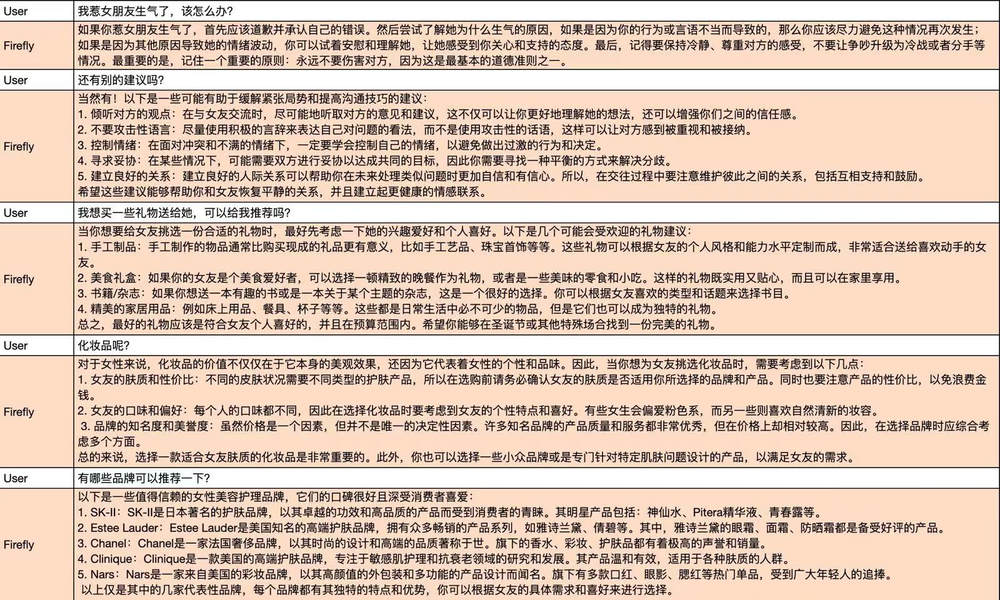
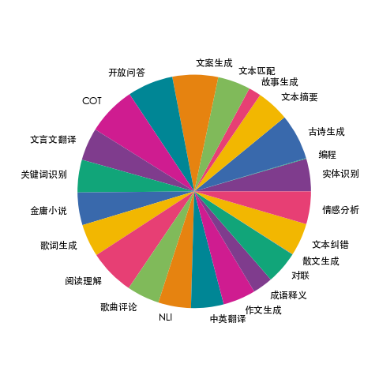
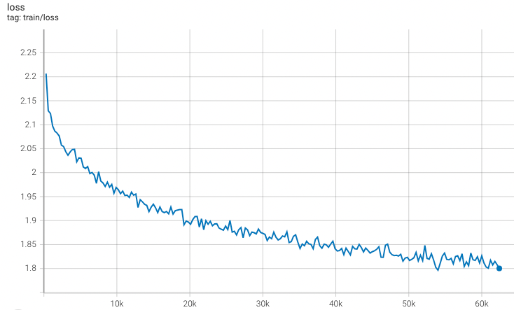
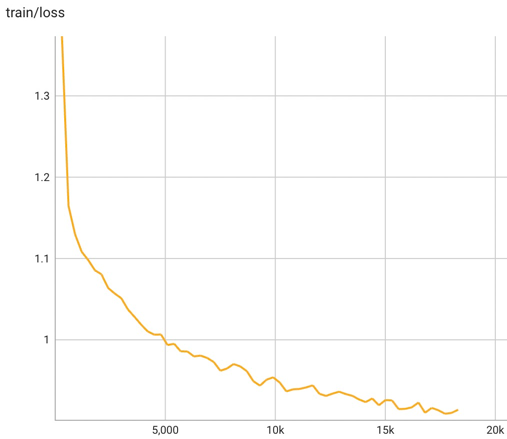

# Firefly(流萤): 中文对话式大语言模型


## 项目简介
**Firefly(流萤)** 是一个开源的中文大语言模型项目，正如我们的项目名称一样，希望本项目能够像流萤一般发出淡淡微光，为中文大语言模型社区尽绵薄之力，促进中文大语言模型社区的发展。

**流萤**（萤火虫的别称）是中华传统文化的一个符号，虽说腐草为萤，带有悲悯意味，但萤火虽小，也能凭借其淡淡荧光，照亮夜空。本项目的名称取自杜牧的《秋夕》：**银烛秋光冷画屏，轻罗小扇扑流萤**。
```text
《咏萤火》 
 唐.李白
雨打灯难灭，
风吹色更明。
若飞天上去，
定作月边星。
```

🔔 本项目主要内容如下：
- 📗 支持全量参数指令微调、QLoRA低成本高效指令微调、LoRA指令微调(后续将会提供支持)。
- 📗 支持绝大部分主流的开源大模型，如百川baichuan、Ziya、Bloom、LLaMA等。
- 📗️ 模型裁剪：通过[LLMPruner：大语言模型裁剪工具](https://github.com/yangjianxin1/LLMPruner) ，开源[裁剪后的Bloom模型权重](https://huggingface.co/YeungNLP) 。在保留预训练中文知识的前提下，有效减少模型参数量，降低训练成本，提高训练效率。
- 📗 开源和整理指令微调数据集：[firefly-train-1.1M](https://huggingface.co/datasets/YeungNLP/firefly-train-1.1M) 、[moss-003-sft-data](https://huggingface.co/datasets/YeungNLP/moss-003-sft-data) 、[ultrachat](https://huggingface.co/datasets/YeungNLP/ultrachat) 。
- 📗 开源[Firefly系列指令微调模型权重](https://huggingface.co/YeungNLP) 。

🔔 下图是firefly-bloom-7b1-qlora-v0.1的多轮对话的生成效果。

 

[//]: # (相关资料：)

[//]: # (- [【QLoRA实战】使用单卡高效微调bloom-7b1，效果惊艳]&#40;https://mp.weixin.qq.com/s/DED7yeiE0DibsVzTmMeDOw&#41;)

[//]: # (- [中文对话式大语言模型Firefly-2b6开源，使用210万训练数据]&#40;https://mp.weixin.qq.com/s/FeMyvQ4EHmseY3H7gY03hw&#41;)

[//]: # (- [Firefly&#40;流萤&#41;: 中文对话式大语言模型]&#40;https://mp.weixin.qq.com/s/TX7wj8IzD_EaMTvk0bjRtA&#41;)

[//]: # (- [LLMPruner：大语言模型裁剪工具]&#40;https://mp.weixin.qq.com/s/leVtrwZc1zLput51Nr99lw&#41;)

## 模型下载
本项目开源的模型命名规范如下：**firefly-{BaseModel}-{ModelSize}-{TrainMethod}-{Stage}-(Version)**:
- BaseModel：基座模型。
- ModelSize：模型参数量。
- TrainMethod：训练方法。一般为lora、qlora或者空，若为空表示全量参数微调。
- Stage：sft、rlhf或者空。若为空，表示预训练模型。
- Version：模型版本。若为空，表示第一版。

🔔 使用本项目的训练代码，以及上述训练数据，我们训练并开源了以下模型。

| 模型                                                                                               | 基座模型                  | 训练数据               | Batch Size | Max Length | LR   | Train Step |
|--------------------------------------------------------------------------------------------------|-----------------------|--------------------|------------|------------|---------|------------|
| [firefly-bloom-1b4-sft](https://huggingface.co/YeungNLP/firefly-bloom-7b1-sft)                   | YeungNLP/bloom-1b4-zh | 160万               | 16         | 512        | 3e-5 | 90k        |
| [firefly-bloom-2b6-sft](https://huggingface.co/YeungNLP/firefly-bloom-2b6-sft)                   | YeungNLP/bloom-2b6-zh | 210万               | 8          |    512        |  3e-5    | 260k       |
| [firefly-bloom-2b6-sft-v2](https://huggingface.co/YeungNLP/firefly-bloom-2b6-sft-v2) ⭐           | YeungNLP/bloom-2b6-zh | 376万               | 60         |   512         | 2e-5     | 62k        |
| [firefly-bloom-7b1-qlora-sft-v0.1](https://huggingface.co/YeungNLP/firefly-bloom-7b1-qlora-sft-v0.1) | bigscience/bloom-7b1  | 29万（moss） | 16         |   1024         |  2e-4    | 18k        |
| [firefly-bloom-7b1-qlora-sft](https://huggingface.co/YeungNLP/firefly-bloom-7b1-qlora-sft) ⭐     | bigscience/bloom-7b1  | 100万（moss+ultrachat） | 64         |   1024         |  2e-4    | 16k        |
| [firefly-baichuan-7b-qlora-sft](https://huggingface.co/YeungNLP/firefly-baichuan-7b-qlora-sft) ⭐ | baichuan-inc/baichuan-7B      | 100万（moss）         | 64         |1024     |    2e-4        | 16k        |           


## 训练数据
🔔 目前本项目主要整理了如下指令数据集，并将其整理成统一的数据格式：

| 数据集                                                                  | 介绍                                                                                                                  |
|----------------------------------------------------------------------|---------------------------------------------------------------------------------------------------------------------|
| [firefly-train-1.1M](https://huggingface.co/datasets/YeungNLP/firefly-train-1.1M) | 我们收集了23种常见的中文NLP任务的数据，并且构造了许多与中华文化相关的数据，如对联、作诗、文言文翻译、散文、金庸小说等。对于每个任务，由人工书写若干种指令模板，保证数据的高质量与丰富度，数据量为115万 |
| [moss-003-sft-data](https://huggingface.co/datasets/YeungNLP/moss-003-sft-data) | 由复旦大学MOSS团队开源的中英文多轮对话数据，包含100万+数据                                                                                   |
| [ultrachat](https://huggingface.co/datasets/YeungNLP/ultrachat)           | 由清华大学开源的英文多轮对话数据，包含140万+数据                                                                                          |


训练数据为jsonl格式，每一行的数据格式如下，其中conversation字段是必需的，可以根据实际需求添加或删除其他字段。
可以参考项目中的data/dummy_data.jsonl文件。
```json
{
    "conversation_id":44,
    "category":"Brainstorming",
    "conversation":[
        {
            "human":"怎么能够有效地提升个人能力？",
            "assistant":"提升个人能力可以通过以下几个方面实现：\n\n1. 学习新知识和技能：阅读相关书籍、参加课程和工作坊、观看教育视频等学习方式，可以帮助你掌握新的知识和技能，从而提升个人能力。\n\n2. 持续练习和实践：不断地练习和实践所学的知识和技能，可以帮助你更好地掌握和应用这些技能，提高你的表现和效率。\n\n3. 寻求反馈和改进：寻求他人的反馈和建议可以帮助你发现自己的不足之处，进一步完善和改进自己的能力。\n\n4. 建立良好的工作和生活习惯：建立良好的工作和生活习惯，如合理安排时间、注意健康、保持积极态度等，可以提高你的工作效率和生活品质，从而提升个人能力。\n\n5. 社交和交流：与他人交流和合作，可以帮助你更好地了解他人的观点和经验，从而提升自己的能力和见识。"
        },
        {
            "human":"对于初学者来说，如何快速掌握编程技能？",
            "assistant":"以下是几个建议，可以帮助初学者快速掌握编程技能：\n\n1. 学习基础知识：建议先学习编程语言的基础知识和语法，例如变量、数据类型、控制结构、函数等。可以通过在线课程、编程书籍、视频教程等方式学习。\n\n2. 实践编程：进行实际的编程练习是非常重要的，可以通过参加编程挑战、编写小项目等方式来进行实践。\n\n3. 寻求反馈：可以寻求他人的反馈和建议，例如在线编程社区、编程导师等，他们可以帮助你发现问题并及时纠正。\n\n4. 阅读优秀代码：阅读和分析优秀的代码可以帮助你学习其他程序员的编程思路和技巧，从而提高自己的编程能力。\n\n5. 不断学习和更新：编程技术和工具在不断更新和发展，因此需要不断学习新的知识和技能，例如学习新的编程语言、框架、工具等，以跟上技术的发展和变化。\n\n总之，学习编程需要耐心和坚持，并且需要不断地实践和学习。通过以上建议，可以帮助初学者快速掌握编程技能。"
        },
        {
            "human":"除了参加编程挑战和阅读代码，还有哪些方式可以提升自己的编程能力呢？",
            "assistant":"除了参加编程挑战和阅读代码，还有以下几种方式可以提升自己的编程能力：\n\n1. 参与开源项目：加入一个开源项目，可以让你了解到实际的软件开发流程和团队合作方式，并且可以与其他开发人员合作，学习和分享编程技巧和经验。\n\n2. 进行代码重构：对已经编写的代码进行重构，可以帮助你了解更好的编程实践和设计模式，从而提高代码的可读性和可维护性。\n\n3. 练习算法和数据结构：算法和数据结构是编程中的重要基础，练习算法和数据结构可以帮助你了解不同的数据结构和算法，从而更好地解决实际问题。\n\n4. 学习软件工程和架构：学习软件工程和架构的知识，可以帮助你了解如何设计和构建可靠、可扩展和可维护的软件系统。\n\n5. 参加编程社区和论坛：参加编程社区和论坛可以让你与其他开发人员分享和讨论编程经验和技巧，了解最新的技术趋势和解决方案。\n\n总之，提升编程能力需要不断地学习和实践，并与其他开发人员和编程专家进行交流和合作，以获取更多的经验和知识。"
        },
        {
            "human":"你有没有推荐的编程挑战网站？",
            "assistant":"当然，以下是一些值得推荐的编程挑战网站：\n\n1. HackerRank：HackerRank 是一个全球领先的技术招聘平台，提供数百种编程挑战和比赛，包括算法、数据结构、数学、SQL、AI 等多个技术领域。\n\n2. LeetCode：LeetCode 是一个在线编程学习和实践平台，提供数千道编程题目，主要涵盖算法和数据结构。\n\n3. Codeforces：Codeforces 是一个全球知名的编程竞赛网站，提供数百个比赛和练习题目，主要涵盖算法和数据结构。\n\n4. Codewars：Codewars 是一个在线编程学习和实践平台，提供数千道编程题目，主要涵盖算法、数据结构、面向对象编程等多个技术领域。\n\n5. Project Euler：Project Euler 是一个非营利性的在线编程挑战平台，提供一系列数学和计算机科学问题，需要用编程语言进行解答。\n\n以上这些编程挑战网站可以帮助你提高编程能力，并且可以与其他编程爱好者进行交流和竞争。"
        },
        {
            "human":"在学习编程的过程中，如何避免陷入困境和放弃呢？",
            "assistant":"学习编程是一个需要长期坚持和不断学习的过程，以下是一些避免陷入困境和放弃的方法：\n\n1. 制定合理的学习计划：制定合理的学习计划，包括学习时间、学习内容、目标等，可以帮助你更好地管理时间和精力，避免学习过程中的松懈和分心。\n\n2. 寻找合适的学习资源：选择适合自己的学习资源，例如在线课程、编程书籍、视频教程等，可以让你更好地了解和掌握编程知识和技能。\n\n3. 寻求帮助和支持：在学习过程中，遇到问题和困难是很正常的，可以寻求他人的帮助和支持，例如参加编程社区、找到编程导师等。\n\n4. 进行实践和项目：实践和项目是学习编程的重要组成部分，可以帮助你更好地了解和掌握编程技能，同时也可以提高学习的兴趣和动力。\n\n5. 坚持并保持兴趣：坚持学习和保持兴趣是学习编程的关键。可以通过参加编程社区、参加编程竞赛、与其他编程爱好者交流等方式来保持兴趣和动力。\n\n总之，学习编程需要耐心和坚持，并需要不断学习和实践。通过以上方法可以帮助你避免陷入困境和放弃。"
        }
    ],
}
```

其中firefly-train-1.1M的数据分布如下图所示：

 


## 模型使用
<details><summary><b>单轮对话脚本</b></summary>

```python
from peft import PeftModel
from transformers import AutoModelForCausalLM, AutoTokenizer
import torch
model_name = 'baichuan-inc/baichuan-7B'
adapter_name = 'YeungNLP/firefly-baichuan-7b-qlora-sft'
max_new_tokens = 500
top_p = 0.9
temperature = 0.35
repetition_penalty = 1.0
device = 'cuda'
input_pattern = '<s>{}</s>'
model = AutoModelForCausalLM.from_pretrained(
    model_name,
    trust_remote_code=True,
    low_cpu_mem_usage=True,
    torch_dtype=torch.float16,
    device_map='auto'
)
model = PeftModel.from_pretrained(model, adapter_name)
model.eval()
model = model.to(device)
tokenizer = AutoTokenizer.from_pretrained(model_name, trust_remote_code=True)
text = input('User：')
while True:
    text = input_pattern.format(text)
    input_ids = tokenizer(text, return_tensors="pt").input_ids
    input_ids = input_ids.to(device)
    outputs = model.generate(
        input_ids=input_ids, max_new_tokens=max_new_tokens, do_sample=True, 
        top_p=top_p, temperature=temperature, repetition_penalty=repetition_penalty, 
        eos_token_id=tokenizer.eos_token_id
    )
    rets = tokenizer.batch_decode(outputs)
    output = rets[0].strip().replace(text, "").replace('</s>', "")
    print("Firefly：{}".format(output))
    text = input('User：')
```
</details>


<details><summary><b>多轮对话脚本</b></summary>

```python
from transformers import AutoModelForCausalLM, AutoTokenizer
from peft import PeftModel
import torch
device = 'cuda'
model_name = 'baichuan-inc/baichuan-7B'
adapter_name = 'YeungNLP/firefly-baichuan-7b1-qlora-sft'
max_new_tokens = 500
top_p = 0.9
temperature = 0.35
repetition_penalty = 1.0
tokenizer = AutoTokenizer.from_pretrained(model_name, trust_remote_code=True)
model = AutoModelForCausalLM.from_pretrained(
    model_name,
    trust_remote_code=True,
    low_cpu_mem_usage=True,
    torch_dtype=torch.float16,
    device_map='auto'
)
model = PeftModel.from_pretrained(model, adapter_name)
model.eval()
model = model.to(device)
# 记录所有历史记录
history_token_ids = tokenizer('<s>', return_tensors="pt").input_ids
# 输入模型的最大长度
history_max_len = 1000
user_input = input('User：')
while True:
    user_input = '{}</s>'.format(user_input)
    user_input_ids = tokenizer(user_input, return_tensors="pt").input_ids
    history_token_ids = torch.concat((history_token_ids, user_input_ids), dim=1)
    model_input_ids = history_token_ids[:, -history_max_len:].to(device)
    outputs = model.generate(
        input_ids=model_input_ids, max_new_tokens=max_new_tokens, do_sample=True, top_p=top_p,
        temperature=temperature, repetition_penalty=repetition_penalty, eos_token_id=tokenizer.eos_token_id
    )
    model_input_ids_len = model_input_ids.size(1)
    response_ids = outputs[:, model_input_ids_len:]
    history_token_ids = torch.concat((history_token_ids, response_ids.cpu()), dim=1)
    response = tokenizer.batch_decode(response_ids)
    print("Firefly：" + response[0].strip().replace('</s>', ""))
    user_input = input('User：')
```

</details>

## 模型训练
目前支持全量参数指令微调、QLoRA指令微调，后续会添加对LoRA的支持（经过实测，QLoRA的效率与效果优于LoRA）。

我们将训练中使用的各种组件抽取出来，以便后续的扩展和优化，详见component目录下的实现。训练时的参数配置存储在train_args目录下，方便统一管理和更改。

🔔 一些优秀的中文预训练模型权重，理论上，HuggingFace上开源的模型，均可使用本项目进行训练：
- [词表裁剪后的bloom系列模型](https://github.com/yangjianxin1/LLMPruner) ：下游任务以中文为主，且训练资源紧缺时，建议使用，比原生的bloom权重更节省显存。
- [原生bloom系列模型](https://huggingface.co/bigscience) ：适用于多语言任务，也适用中文任务。进行指令微调时，建议使用bloom模型，不要使用bloomz，该模型可商用。
- [baichuan-7B](https://huggingface.co-inc/baichuan-7B) ：百川智能的中文预训练模型，相比bloom，预训练更充分，且可商用。

### 数据格式
训练时，我们将多轮对话拼接成如下格式，然后进行tokenize。其中<s\>表示bos_token，</s\> 表示eos_token。
```
<s>input1</s>target1</s>input2</s>target2</s>...
```

### 全量参数微调
💻 执行如下命令即可进行全量参数微调：
```bash
deepspeed --num_gpus={num_gpus} train.py --train_args_file train_args/sft.json
```

📝 train_args/sft.json中的主要参数说明如下，以下参数可以根据需求进行修改，其他参数建议不做修改：
- output_dir：训练输出目录，存储checkpoint、tokenizer、tensorboard等
- model_name_or_path：预训练模型的本地目录，或者在huggingface上的模型名称。
- train_file：训练数据集路径。可以使用data/dummy_data.jsonl进行debug。
- num_train_epochs：训练的轮次。如果数据量足够大，一般建议只训一个epoch。
- per_device_train_batch_size：每张显卡的batch size。
- gradient_accumulation_steps：梯度累计步数。global step=num_gpus * per_device_train_batch_size * gradient_accumulation_steps。
- gradient_checkpointing：如果显存捉襟见肘，可以开启。以时间换空间，模型不缓存激活状态，会进行两次forward计算，以节省显存。
- learning_rate：学习率。全量参数微调的时候，建议小一些，1e-5或5e-6。
- max_seq_length：训练时的最大长度。按照自己的设备进行设置，越长需要占用越多显存。
- logging_steps：每隔多少步统计一次train loss。
- save_steps：每隔多少步保存一个模型。
- save_total_limit：output_dir目录中最多保存多少个checkpoint，超出则会将最旧的删除。
- lr_scheduler_type：学习率变化策略。
- warmup_steps：warm up步数。学习率经过多少步，增长到指定的数值。
- optim：优化器。如果是全量参数微调，建议使用adamw_hf。
- seed：随机种子，用于复现实验结果。
- fp16：使用使用fp16混合精度。V100建议开启。
- bf16：使用使用fp16混合精度。A100建议开启。

firefly-bloom-2b6-sft-v2的训练损失的变化趋势如下图所示：

 

### QLoRA微调

关于QLoRA的详细介绍可参考文章：[【QLoRA实战】使用单卡高效微调bloom-7b1，效果惊艳](https://mp.weixin.qq.com/s/DED7yeiE0DibsVzTmMeDOw)

QLoRA通过4-bit的nf4量化，且加入更多adapter，在大幅减少显存消耗的同时，尽可能逼近全量参数微调的效果。
QLoRA论文指出，该方法可以在一张V100上对33B的模型进行微调，并且性能逼近全量参数微调。

我们在bloom-7b1上使用qlora，adapter的参数量约1.2亿，超过bert-base模型参数量，可以在V100上使用1024的长度进行训练。

💻 执行如下命令即可进行QLoRA微调：
```bash
torchrun --nproc_per_node={num_gpus} train_qlora.py --train_args_file train_args/baichuan-sft-qlora.json
```

📝 train_args/sft-qlora.json中的主要参数说明如下，基本与全量微调的参数一致，几个较为特殊：
- lora_rank：qlora矩阵的秩。一般设置为8、16、32、64等，在qlora论文中作者设为64。越大则参与训练的参数量越大，一般来说效果会更好，但需要更多显存，。
- lora_alpha: qlora中的缩放参数。一般设为16、32即可。
- lora_dropout: lora权重的dropout rate。
- learning_rate：qlora中的学习率设置更大一些，一般为1e-4、2e-4。


firefly-bloom-7b1-qlora-sft-v0.1的训练损失的变化趋势如下图所示：

 

## FAQ
#### 问题1：OOM如何解决？
如果发生OOM，可以缩小per_device_train_batch_size、max_seq_length等参数来缓解。也可以设gradient_checkpointing=true，可以大幅降低显存占用，但训练速度会变慢一些。

#### 问题2：安装包错误
下面四个python包，建议使用源码安装，后续待其稳定版本了，我们将会在requirements.txt更新版本号
```bash
pip install git+https://github.com/huggingface/peft.git
pip install git+https://github.com/huggingface/accelerate.git
pip install git+https://github.com/huggingface/transformers.git
pip install git+https://github.com/TimDettmers/bitsandbytes.git
```

#### 问题3：是否支持DeepSpeed+QLoRA？
我们尝试过DeepSpeed+QLoRA的训练策略，但尚未成功，目前建议使用torchrun启动训练。后续若成功，我们将更新代码。

#### 问题4：如何指定使用某些卡训练？
通过如下方式，即可指定使用0和1号卡进行训练:
```bash
CUDA_VISIBLE_DEVICES=0,1 torchrun --nproc_per_node={num_gpus} train_qlora.py --train_args_file train_args/baichuan-sft-qlora.json
```


## 局限性和使用限制
目前本项目开源的模型均为7B及7B以下，模型参数量较小。所以在效果上可能存在以下问题：
- 对于事实性知识，容易产生错误的回复。
- 由于未经过无害化微调，可能会产生歧视、危害、违背伦理道德的言论。
- 在代码、推理上的能力仍有欠缺。

基于以上模型的局限性，我们要求本项目的代码、数据、模型不得用于对社会造成危害的用途。

## 引用
若使用本项目的数据、代码或模型，请引用本项目。
```text
@misc{Firefly,
  author = {Jianxin Yang},
  title = {Firefly(流萤): 中文对话式大语言模型},
  year = {2023},
  publisher = {GitHub},
  journal = {GitHub repository},
  howpublished = {\url{https://github.com/yangjianxin1/Firefly}},
}
```

## 关注我们

 

## 生成效果
下面的样例均为firefly-bloom-2b6-sft-v2模型所生成，未经修改，部分生成内容可能存在事实性错误，仅供参考。

<details><summary><b>医疗问答</b></summary>

| 输入                                                                                                                                                                                                                                                                                     | 输出  |
|----------------------------------------------------------------------------------------------------------------------------------------------------------------------------------------------------------------------------------------------------------------------------------------|-----|
|小张最近感觉身体不适，出现心悸、气促等症状。体检发现心脏扩大、搏动减弱。|根据你的描述考虑是心肌炎的可能，建议到医院检查一下看看，注意饮食避免辛辣刺激性食物，注意多休息，必要时去医院做进一步检查与治疗|
|艾滋病是如何传染的？|艾滋病是通过性接触、血液和母婴三种途径传播的。在性生活中，通过精液进入人体内，造成感染。血液中含有的病毒可通过注射吸毒等行为进行传播。另外，孕妇也可以将病毒传给胎儿。|
|口腔溃疡的原因及治疗方法|口腔溃疡一般与上火，缺乏维生素，免疫力低下等有关。建议平时多喝水，多吃蔬菜水果，补充充足的维生素，不要吃辛辣刺激的食物，注意休息和营养的搭配。可以口服维生素C片，V-B1片，VB12片治疗，同时外用西瓜霜喷雾剂喷雾治疗效果不错。|
|什么造成了胃溃疡？|一般认为与幽门螺旋杆菌感染有关，建议用奥美拉唑、阿莫西林和克拉霉素治疗。平时饮食要规律，避免辛辣刺激性的食物，注意休息|
|痛风是由什么引起的？|痛风是一种代谢性疾病，以高尿酸血症为主要特征。急性期治疗原则是限制饮食、控制体重和避免饮酒等。慢性期则需要长期口服药物如秋水仙碱片、苯溴马隆、别嘌醇等。|
|肛门流血不疼吃什么药|根据你的描述可能是痔疮，建议到医院肛肠科检查确诊。注意饮食避免辛辣刺激性食物，多吃蔬菜水果粗粮，多喝水，不要久坐，经常清洗肛门部，勤换内裤比较好治疗上可以口服槐角丸和痔速宁片，局部需要使用马应龙痔疮膏来治疗的|
|便秘和便血是什么病|大便带血是痔疮的主要症状之一，但是不能一见便血就以为是痔疮，因为消化道疾病和全身性疾病都可以引起便血。建议你到正规医院肛肠科就诊检查，明确诊断再治疗。平时注意饮食清淡，多喝水，多吃蔬菜水果，避免辛辣刺激食物的摄入。|

</details>

<details><summary><b>商品文案生成</b></summary>

| 输入                                                                                        | 输出  |
|-------------------------------------------------------------------------------------------|-----|
| 根据标题生成商品文案：南极人羽绒服男短款秋冬轻盈保暖休闲男装男士羽绒冬装外套                                                    |90后潮搭撞色纯颜色羽绒服，精选优质面料，抗寒保暖能力强，穿着更舒适，简约时尚的款式，体现出干练简单的气息，采用轻盈、轻薄、温暖的开发理念设计，颠覆传统羽绒服的概念，让你真正暖到心|
| 假如你现在是一名优秀的服装销售员，现在请你根据下面的关键词，向你的客户介绍商品，生成商品描述：类型：裙；风格：简约；图案：条纹；图案：线条；图案：撞色；裙型：鱼尾裙；裙袖长：无袖 |这款优雅的鱼尾裙采用经典的无袖设计，展现出纤细的手臂和优美的曲线。同时搭配一条简洁的条纹，让整体的造型更加时尚大气。在颜色上，以深浅不一的颜色呈现，给人一种清新自然的感觉。此外，还加入了撞色的元素，使整体更具视觉冲击力。穿上它，让你轻松成为人群中的焦点|
| 请你扮演一名销售员，对洗衣液的卖点进行描述，着重突出下面的关键词：干净，无残留，清香，无异味，除菌                                         |我们的洗衣液是您家庭清洁的最佳选择！它采用最先进的技术和配方，能够彻底清除您的衣物上的任何污渍、细菌和其他有害物质。同时，我们使用天然成分，不含任何化学物质，让您的衣服保持清新、无异味，并且更加健康环保。最重要的是，我们的产品还具有抗菌功能，可以保护您的家人免受病菌侵害。现在就试试吧|
| 你是一名优秀且经验丰富的电商卖家，现在请你对一部非智能手机生成卖点，着重突出下面的商品特点，要求200字描述：操作简单，续航持久，耐摔，适合老年人，保修三年            |这款手机是一款非常实用的产品。它采用简单易懂的界面设计，用户可以轻松上手使用。同时，它的电池寿命也很长，一次充电可以使用数天，而且不会出现过热现象。<br>此外，这款手机还具有出色的抗摔性能，即使是在日常的碰撞中也能保持完好无损。对于老年人或身体不便的人来说，这款手机也是非常方便的选择。其支持无线充电和数据同步功能，让用户随时随地都能享受到便利的服务。<br>最后，这款手机还有着三年的保修期，保证了用户在购买后能够得到及时、有效的维修服务。总之，这款手机不仅实用性强，同时还具备良好的性价比，是您的不二之选|
</details>

<details><summary><b>古诗、对联、文言文</b></summary>

| 输入                                                                                                                                                                | 输出                                                                                                                                          |
|-------------------------------------------------------------------------------------------------------------------------------------------------------------------|---------------------------------------------------------------------------------------------------------------------------------------------|
| 以春天为题目，帮我写一首古诗，要求包含燕子、春风、柳树等元素，古诗：                                                                                                                                | 春风吹拂燕归来，<br>柳枝摇曳舞翩跹。<br>花开满园香气溢，<br>鸟语声中乐无边。                                                                                                |
| 以咏梅为题目，帮我写一首古诗，要求包含梅花、白雪等元素。古诗：                                                                                                                                   | 白雪纷纷落，<br>梅花含笑开。<br>清香扑鼻来，<br>素雅动人心。<br>枝头挂冰玉，<br>叶上缀珠玑。<br>寒冬不凋零，<br>春风又何妨？<br>此情谁能识，<br>惟愿君知晓。                                            |
|我要与朋友分别了，请你写一首古诗，表达我的离别之情。|好的，我将为您创作一首关于离别的诗歌。<br>离别情深似海潮，<br>相思难耐泪涟涟。<br>天涯何处觅知音？<br>唯有明月共清辉|
| 背诵苏轼的《水调歌头·明月几时》                                                                                                                                                  | 明月几时有，把酒问青天。不知天上宫阙，今夕是何年？我欲乘风归去，又恐琼楼玉宇，高处不胜寒；起舞弄清影，何似在人间！转朱阁，低绮户，照无眠。不应有恨，何事长向别时圆？人有悲欢离合，月有阴晴圆缺，此事古难全。但愿人长久，千里共婵娟。                          |
|背诵古诗，题目：登高，作者：杜甫| 风急天高猿啸哀，渚清沙白鸟飞回。无边落木萧萧下，不尽长江滚滚来。万里悲秋常作客，百年多病独登台。艰难苦恨繁霜鬓，潦倒新停浊酒杯。                                                                            |
|上联：江边惯看千帆过| 下联：岸上闲听百鸟蹄                                                                                                                                  |
| 把下面的文本翻译成现代文：林尽水源，便得一山，山有小口，仿佛若有光。便舍船，从口入。初极狭，才通人。复行数十步，豁然开朗。土地平旷，屋舍俨然，有良田、美池、桑竹之属。阡陌交通，鸡犬相闻。其中往来种作，男女衣着，悉如外人。                                                    | 到了这里，只见一山峰上有一个小洞口，好像有光芒照耀出来，就放弃船只，顺着洞口进去，最初时十分狭窄，只能容一个人通过，又走了几十步，豁然开阔起来，土地平坦宽广，房屋整齐，有良田、美池和桑树竹子之类，道路纵横交错，鸡狗互相叫唤，中间来往的农夫耕作，男女人穿衣服打扮得跟外面的人一样。 |
| 把下面的文本翻译成文言文：到了春风和煦，阳光明媚的时候，湖面平静，没有惊涛骇浪，天色湖光相连，一片碧绿，广阔无际；沙洲上的鸥鸟，时而飞翔，时而停歇，美丽的鱼游来游去，岸上与小洲上的花草，青翠欲滴。有时大片烟雾完全消散，皎洁的月光一泻千里，波动的光闪着金色，静静的月影像沉入水中的玉璧，渔夫的歌声在你唱我和地响起来，这种乐趣真是无穷无尽啊！ | 及春风和日，晴景霁丽，湖平无波澜，天影连空，广袤无涯；沙洲之鸥，或翱翔，或止息，美鱼浮动，渚花摇荡；或大雾既散，皎月万里，光烨金辉，寂照澄澈，渔夫之歌，于汝我者，其乐实多矣！                                                     |
</details>


<details><summary><b>创意性写作</b></summary>

| 输入                                                                                                | 输出  |
|---------------------------------------------------------------------------------------------------|-----|
| 根据标题生成一篇文章，要求400字：全面推进乡村振兴 加快建设农业强国                                                               |随着我国经济社会的不断发展，农村人口逐渐增多，而乡村振兴也成为了当前社会的重要议题。为了实现“乡村振兴”，我们需要从多个方面入手。<br>首先，要加强教育投入。在乡村地区，学校资源相对匮乏，学生们接受的教育水平有限，因此需要加大对乡村教育的投资力度。政府可以设立更多的义务教育学校和特殊教育学校，同时也可以鼓励企业、组织等参与到乡村教育的发展中来。此外，还可以通过开展各种形式的培训活动，提高学生的综合素质和能力。<br>其次，要促进城乡统筹发展。乡村地区的经济发展离不开城市的支持，但乡村的经济发展也需要得到城市的关注和支持。政府和企业可以通过建立合作机制，将城市的发展与乡村的产业结构调整相结合，推动城乡经济的协同发展。例如，可以利用现代化的技术手段，优化农业生产方式，提高生产效率；同时，也可以加强与城市相关部门的合作，共同推进乡村治理和社会管理等方面的工作。<br>第三，要完善社会保障体系。乡村居民的生活条件比较艰苦，他们往往缺乏基本的社会保障制度，如医疗保险、养老保险等等。为此，政府应该加强对乡村居民的社保支持和服务，为他们提供更加完善的福利待遇。同时，也要积极探索新的社会保障模式，为乡村居民提供更多元化、个性化的服务。<br>最后，要加强宣传和教育。乡村振兴是一个长期的过程，需要全社会的共同努力。政府、媒体、NGO等机构可以通过多种渠道进行宣传和教育，让更多的人了解乡村发展的现状和问题，激发他们的参与热情和责任感。同时，也可以借助互联网平台，推广乡村旅游、文化交流等方面的信息，吸引更多的游客前来参观乡村，从而带动乡村旅游业的发展。<br>综上所述，乡村振兴是当今社会的一个重要课题，需要各方力量的共同努力。只有我们齐心协力，才能让乡村变得更加美丽宜居！|
| 写一段关于日落的描述，要求细节生动，景色美好，要求200字。                                                                    |夕阳西下，天空渐渐染上了深红色和橙色。太阳缓缓落下，将整个天空映照成一片金黄色。云彩也随之变幻着颜色，从淡蓝色到深紫色再到粉色，仿佛一幅美丽的画卷展现在眼前。<br>随着时间的推移，太阳逐渐消失在地平线之下，留下了一片宁静的景象。远处的山峦在晚霞中变得格外壮观，它们似乎被涂上了一层金色的颜料，让人不禁感叹大自然的神奇与美丽。<br>此时此刻，人们的心情也跟着愉悦起来。在这个美好的时刻里，我们可以感受到大自然的魅力和力量，让我们更加珍惜每一刻时光，享受生命中的每一个瞬间|
| 根据题目写一首散文：荷塘月色。要求包含荷花、月光、池塘、清风、夏日等元素。                                                             |夏日的夜晚，荷塘的月亮格外明亮，照耀着整个池塘和周围的一切。<br>在微风吹拂下，荷叶轻轻摇晃，发出沙沙的声音，仿佛是欢迎远方的朋友来到这里。<br>池塘里的莲花开得正艳丽，白如雪，粉似霞，散发出迷人的芬芳气息。它们挨挨挤挤地生长在一起，像一个个小圆盘一样，又像一朵朵盛开的鲜花。<br>夜幕降临，星星点点的天空映衬着皎洁的月光，让人感到无比宁静与美好。偶尔有一只萤火虫飞过，它闪烁着荧光，像是给这静谧的夜晚增添了一抹亮丽的色彩。<br>此时此刻，人们不禁感叹大自然的神奇魅力，也深深地被它的美丽所吸引。在这安静而祥和的夜晚里，我们感受到了大自然的魅力和力量，让我们更加珍惜这份美好的时光。|
| 请生成一篇关于人工智能对教育行业的影响的文章，包括挑战和机遇。                                                                   |随着人工智能技术的不断发展，它已经开始在各个领域发挥作用，其中之一是教育行业。尽管人工智能技术在教育领域的应用还处于起步阶段，但它已经开始改变着教育的面貌。<br>首先，人工智能可以帮助教师更好地个性化教学。通过分析学生的学习风格、兴趣爱好以及知识水平等数据，人工智能可以为每个学生提供最适合他们的课程内容和方式，从而提高学生的学习效果。此外，人工智能还可以帮助教师自动评估学生的作业和考试成绩，减轻了教师的工作负担，提高了工作效率。<br>其次，人工智能也可以改善学生的学习体验。例如，虚拟现实技术和增强现实技术可以让学生身临其境地参与到各种场景中，如历史事件、科学实验等等，这不仅能够增加学生的兴趣，也能够让学生更加深入地理解所学的内容。同时，人工智能还可以根据学生的表现来调整自己的算法，以适应不同的学习者需求。<br>然而，人工智能在教育中的应用也面临着一些挑战。一方面，由于人工智能需要大量的数据和计算资源支持，因此对于学校和教育机构来说，这些资源的投入成本可能很高；另一方面，人工智能算法的可解释性也是一个问题，因为当机器做出决策时，我们无法知道它的依据是什么，这也限制了人们对人工智能的接受程度。<br>总的来说，人工智能对教育行业的应用带来了许多机会和挑战。虽然人工智能不能完全取代人类的教育工作者，但是它可以成为他们的一种有力辅助工具，帮助人们更高效地进行学习和工作。未来，我们可以期待看到更多的人工智能技术应用于教育领域，推动教育变得更加高效和创新。|
| 假设你现在是一名记者，你将报道突发新闻，撰写专题报道和评论文章，开发用于验证信息和发现来源的研究技术，遵守新闻道德，并使用你自己独特的风格提供准确的报道。请你写一篇关于美国的空气污染的新闻报道。 |据最新数据显示，美国全国范围内的空气质量指数（PM2.5）已经超过了世界卫生组织设定的安全标准。其中，洛杉矶、纽约等城市的空气质量指数更是创下了历史最高水平。<br>专家指出，这种严重的环境问题主要源于工业生产和交通运输业的发展。同时，城市规划不合理也加剧了空气污染的问题。政府和社会各界应该共同努力，采取有效措施减少污染物排放，改善空气质量。<br>针对这一问题，一些环保组织和个人也在积极行动。他们呼吁政府和企业加强监管和管理，推广清洁能源和新能源汽车，鼓励居民采取低碳生活方式，共同保护我们的地球家园。<br>对于普通民众而言，也可以从自身做起，少开车、多骑自行车或步行，节约用水用电，尽可能地减少对环境的负面影响。只有全社会齐心协力，才能让我们的美丽蓝天更加清新宜人|
| 写一封商务邮件给客户，表达因为物流延误，不能如期到达，我们可以赔偿贵公司所有损失                                                          |尊敬的客户，<br>非常抱歉地通知您，由于我们最近的物流问题，我们的货物无法按时交付。我们已经尽最大努力解决这个问题，但是我们需要一些时间来完成您的订单。<br>我们正在与运输商联系以了解更多情况，并希望尽快处理此事。我们希望能够弥补任何不便或损失，并确保您对我们的服务感到满意。<br>如果您有任何疑问或需要进一步的信息，请随时与我们联系。我们将竭诚为您提供帮助和支持。<br>再次感谢您的耐心等待和理解。<br>此致<br>敬礼！<br>[你的名字]     |
|情人节快到了，帮我写一首情诗，送给我女朋友|好的，让我来帮您创作一首情诗吧。<br>爱意如潮水般涌起，<br>思念之情难以言表；<br>你是我生命中的唯一，<br>心中只有你的身影。<br>春风拂面轻轻吹过，<br>花儿绽放着美丽的笑容；<br>每一天都想和你在一起，<br>直到永远的尽头。|
|生成5条关于“稻香”的网抑云音乐热评|1、小时候，把一片口香糖掰成两块儿。 很舍不得吃。那时候就天真的想：等 到我长大了，有钱了，就一口气嚼一 包！一定特别甜！今天突然想到了儿时这个梦想 ，就买了一包，当我把口 香糖一片片塞进嘴里的时候 。我的 眼泪夺眶而出。。我哽咽着大口的嚼着。。心里却满是的酸涩，我想 我再也找不到一块儿那么纯洁的白口香糖了。<br>2、“稻香”就是对故乡的思念，是对亲人的牵挂，是家乡的一草一木都深深烙印在心中，无论何时何地都会想起家乡的美好回忆<br>3、听歌还翻评论？你一定很孤独吧，别问为什么，因为我也是，我爱你，陌生人。<br>4、这首歌是我爷爷最喜欢的歌曲之一，他去世前几天还在哼唱这首曲子呢，现在听到还是会泪目😭😭😭<br>5、《稻香》是一首非常优美的民谣，它以朴实无华的语言表达了对故乡和亲人深沉的爱恋之情，让人回味无穷。|
|以歌颂爱情为主题，写一首歌词|Verse 1:<br>爱是火焰，燃烧在心底，<br>温暖如春日阳光。<br>相伴一生，不离不弃，<br>真挚情感永不变。 <br>Chorus:<br>你是我的唯一，我为你倾心，<br>爱你直到永远，永不分离。<br>我们的故事，像一首动人的诗篇，<br>让我们一起唱响爱的旋律。 <br>Verse 2:<br>风雨中走过，你为我遮风挡雨；<br>患难时刻，你的陪伴让我倍感安慰。<br>无论何时何地，我都想和你在一起，<br>这份感情永远不会消失。 <br>Chorus:<br>你是我的唯一，我为你倾心，<br>爱你直到永远，永不分离。<br>我们的故事，像一首动人的诗篇，<br>让我们一起唱响爱的旋律。 <br>Bridge:<br>在彼此的怀抱里，我们感到无比幸福和满足，<br>因为我们知道，有你在身边就是最美好的事情。<br>让我们携手前行，共同创造美好未来！<br>Chorus:<br>你是我的唯一，我为你倾心，<br>爱你直到永远，永不分离。<br>我们的故事，像一首动人的诗篇，<br>让我们一起唱响爱的旋律|

</details>


<details><summary><b>知识库问答</b></summary>

```text
User:
你是一个优秀的人工智能助手。请你仔细阅读下面的文章，并且给出问题的答案。
你只能使用文章中明确列出的信息，不要编造文章中未列出的信息。如果你不知道答案，就说“我不确定”。 不要试图编造答案。
---
文森特·威廉·梵高（Vincent Willem van Gogh，1853年3月30日—1890年7月29日），荷兰后印象派画家。代表作有《星月夜》、自画像系列、向日葵系列等。
梵高出生于1853年3月30日荷兰乡村津德尔特的一个新教牧师家庭，早年的他做过职员和商行经纪人，还当过矿区的传教士最后他投身于绘画。他早期画风写实，受到荷兰传统绘画及法国写实主义画派的影响。1886年，他来到巴黎，结识印象派和新印象派画家，并接触到日本浮世绘的作品，视野的扩展使其画风巨变。1888年，来到法国南部小镇阿尔，创作《阿尔的吊桥》；同年与画家保罗·高更交往，但由于二人性格的冲突和观念的分歧，合作很快便告失败。此后，梵高的疯病（有人记载是“癫痫病”）时常发作，但神志清醒时他仍然坚持作画。1889年创作《星月夜》。1890年7月，梵高在精神错乱中开枪自杀（一说，两个年轻人不小心走火开枪击中 [27] ），年仅37岁。
---

问题：请向我展示一些关于梵高的信息

Firefly:
梵高是荷兰后印象派画家，代表作品包括《星月夜》、自画像系列、向日葵系列等。他出生在1853年3月30日荷兰乡村津德尔特的一个新教牧师家庭，早年曾做职员和商人，后来成为一名艺术家。他早期的画风写实，受到荷兰传统绘画及法国写实主义画派的影响。他曾在巴黎拜访了印象派和新印象派画家，也接触到了日本浮世绘的作品。他的画风格巨变，在1888年移居法国南部小镇阿尔期间创作了许多著名作品，如 《阿尔的吊桥》和《星月夜》等。然而，在他精神错乱的时候，他经常会患上“癫痫病”（有时也被称为“癫痫症”），但他还是坚持继续作画。他在1889年创作了《星月夜》，并在1890年7月因精神疾病而去世，享年37岁。
```

```text
User:
你是一个优秀的人工智能助手。请你仔细阅读下面的文章，并且给出问题的答案。
你只能使用文章中明确列出的信息，不要编造文章中未列出的信息。如果你不知道答案，就说“我不确定”。 不要试图编造答案。

---
姚明（Yao Ming），男，汉族，无党派人士，1980年9月12日出生于上海市徐汇区，祖籍江苏省苏州市吴江区震泽镇，前中国职业篮球运动员，司职中锋，现任亚洲篮球联合会主席、中国篮球协会主席、中职联公司董事长兼总经理， [1-3]十三届全国青联副主席， [4] 改革先锋奖章获得者。 [5] 第十四届全国人大代表 [108] 。
1998年4月，姚明入选王非执教的国家队，开始篮球生涯。2001夺得CBA常规赛MVP，2002年夺得CBA总冠军以及总决赛MVP，分别3次当选CBA篮板王以及盖帽王，2次当选CBA扣篮王。在2002年NBA选秀中，他以状元秀身份被NBA的休斯敦火箭队选中，2003-09年连续6个赛季（生涯共8次）入选NBA全明星赛阵容，2次入选NBA最佳阵容二阵，3次入选NBA最佳阵容三阵。2009年，姚明收购上海男篮，成为上海久事大鲨鱼俱乐部老板。2011年7月20日，姚明宣布退役。
2013年，姚明当选为第十二届全国政协委员。2015年2月10日，姚明正式成为北京申办冬季奥林匹克运动会形象大使之一。2016年4月4日，姚明正式入选2016年奈史密斯篮球名人纪念堂，成为首位获此殊荣的中国人；10月，姚明成为中国“火星大使”；11月，当选CBA公司副董事长。 [6]
2017年10月20日，姚明已将上海哔哩哔哩俱乐部全部股权转让。 [7] 2018年9月，荣获第十届“中华慈善奖”慈善楷模奖项。 [8] 2019年10月28日，胡润研究院发布《2019胡润80后白手起家富豪榜》，姚明以22亿元排名第48。
---

问题：姚明什么时候生日？

Firefly:
1980年9月12日。
```

</details>


<details><summary><b>数学推理</b></summary>

| 输入                                                                                                | 输出  |
|---------------------------------------------------------------------------------------------------|-----|
|题目：小明在一家超市买了 3 瓶饮料，每瓶饮料的价格是 3 元，他又买了一包面包，面包价格是 10 元，他一共花了多少钱？|1. 首先计算小明购买的饮料的总价。由于他有 3 瓶饮料，每瓶饮料价格为 3 元，所以总共花费的钱数为：3 x 3 = 9 元。<br>2. 然后再加上一包面包的价格，即 10 元，得到小明总共花费的钱数为 9 + 10 = 19 元。<br>答案：小明一共花费了19元|
|题目：小明一共36个鼠标，他要分配给6个小伙伴，每个小伙伴能获得多少个鼠标|1. 用除法求出平均值<br>   36 ÷ 6 = 6<br>2. 小明的每个小伙伴能得到6个鼠标。 <br>答案：每个小伙伴能得到6个鼠标。|
|小明有4袋水果糖，每袋有25个，他一共有多少个水果糖？|1. 找出题目中给出的信息：<br>- 小明有4袋水果糖。<br>- 每袋水果糖的数量为25个。<br>2. 使用乘法计算总数：<br>- 4袋 x 25个/袋 = 100个水果糖。<br>3. 因此，小明一共有100个水果糖|
|小明去市场买了8个橘子，6根香蕉，3个苹果，橘子每个3元，香蕉每个2元，苹果每个5元，她一共花了多少钱？|1. 计算橘子的总价：8 x 3 = 24 元<br>2. 计算香蕉的总价：6 x 2 = 12 元<br>3. 计算苹果的总价：3 x 5 = 15 元<br>4. 将所有商品的价钱相加：24 + 12 + 15 = 42 元<br>答案：小明一共花费了42元|
|小明有38个苹果，分给小红15个，分给小猪8个，他自己还剩多少个苹果？|1. 计算小明分出去的苹果总数：15 + 8 = 23<br>2. 用小明的苹果数减去分出去的苹果总数：38 - 23 = 15<br>3. 小明自己还剩下15个苹果。 <br>答案：小明自己还剩下15个苹果|

</details>


<details><summary><b>多轮对话</b></summary>

```text
User   : 你好，最近睡觉质量不好，晚上总是失眠，或者睡觉惊醒，这是怎么回事
Firefly: 可能是身体或精神上的压力过大引起的。建议您尝试放松身心，如听轻音乐、做瑜伽等活动来帮助入睡。如果问题持续存在，请咨询专业医生的建议。
User   : 最近工作上比较忙，压力有点大，经常熬夜
Firefly: 这听起来很辛苦。您可以考虑调整工作和休息时间，确保每天有足够的睡眠和适当的运动。此外，保持良好的饮食习惯也有助于改善睡眠质量。
User   : 有什么方法缓解吗？
Firefly: 可以试试深呼吸练习、冥想或进行一些轻松的伸展运动。另外，避免在睡前使用电子设备并减少咖啡因摄入也是有帮助的。
User   : 还有别的方法吗？
Firefly: 可以试着建立一个固定的作息时间表，包括起床时间和晚餐时间，以帮助您的身体适应规律的生活方式。同时，也可以通过与朋友聊天、阅读等方式分散注意力，有助于减轻压力和提高睡眠质量。
User   : 有什么药物可以调节
Firefly: 对于长期无法入眠的情况，建议您寻求专业医疗帮助。但是，有一些非处方药可以帮助缓解失眠症状，例如安神补脑液、维生素B群等。
User   : 还有别的药物吗？
Firefly: 当然了，还有一些草药茶可以帮助缓解失眠症状，但需要注意剂量和使用频率。如果您一直感到不适，最好向医生咨询以获取更详细的帮助和建议。
User   : 平时饮食有什么需要注意的吗
Firefly: 建议您尽量少食用刺激性食物，如辛辣食品、油炸食品等。此外，多喝水有助于促进新陈代谢和维持身体健康。最后，不要忘记适当锻炼身体，以提高身体的免疫力，从而更好地应对各种生活挑战。
User   : 还有别的建议吗
Firefly: 是的，还可以尝试一些自然疗法，如按摩、针灸、香薰蜡烛等，这些都可以帮助舒缓紧张的情绪和促进睡眠。
User   : 谢谢
Firefly: 不客气，希望这些建议能对您有所帮助！
```

```text
User   : 我最近在学编程，请你给我推荐几个经典的机器学习算法。
Firefly: 以下是一些经典的机器学习算法：
         1. 线性回归（Linear Regression）- 对于连续型变量进行预测。
         2. 决策树（Decision Tree）- 将数据集划分为不同的类别或值集合。
         3. 支持向量机（Support Vector Machines, SVM）- 在高维空间中寻找一个超平面来分离不同类别的样本。
         4. K近邻（K-Nearest Neighbors, KNNs）- 根据已知类别的样本和未知类别的样本之间的距离计算相似度，并找到与未知样本最相似的K个邻居。
         5. 随机森林（Random Forest）- 使用多个决策树对输入特征进行分类或回归分析。
         6. 神经网络（Neural Networks）- 可以用于图像识别、自然语言处理等任务。
         7. 聚类（Clustering）- 对数据集中的对象进行分组，将它们分成若干组。
         8. 主成分分析（Principal Component Analysis）- 通过统计方法从原始数据集中提取最重要的特征，从而确定数据的分布情况。
         9. 贝叶斯定理（Bayes' Theorem）- 利用已知的概率分布和条件信息来进行推断。
         10. 梯度提升法（Gradient Boosting）- 一种基于训练数据和目标函数的方法，通过迭代优化模型参数，提高模型的准确性。
User   : 请详细介绍一下决策树算法
Firefly: 决策树是一种监督式的分类算法，它通过对数据集的观察和分析，构建一棵树状结构，使得每个节点代表一个属性，每个分支代表该属性的取值范围，最终叶子节点表示所求的目标结果。决策树可以用来解决许多实际问题，如分类、回归、异常检测等。决策树算法的核心思想是将数据集按照一定规则分割成若干个子集，然后根据每个子集的标签（即目标结果）建立相应的决策树，最后得到所有决策树的结果，从而得出最终的答案。决策树算法具有简单易用、可解释性强、易于实现的特点，因此在很多领域得到了广泛的应用。
User   : 那k-means呢
Firefly: k-means是一种无监督式的聚类算法，它可以自动地将数据点分组成k个簇。k-means算法的主要思想是通过迭代的方式不断调整k的值，使k个簇内数据点的平均值尽可能接近，同时保证各个簇内的数据点之间差异最小化。k-means算法适用于各种规模的数据集，并且可以通过调整k的大小来适应不同的场景需求。 
```
</details>


<details><summary><b>其他例子</b></summary>

| 输入                                                                                                                                                                                                                                                                                    | 输出                                                                                                                                                                                                                           |
|---------------------------------------------------------------------------------------------------------------------------------------------------------------------------------------------------------------------------------------------------------------------------------------|------------------------------------------------------------------------------------------------------------------------------------------------------------------------------------------------------------------------------|
|假设你是一个心理咨询师，你会如何帮助患者走出阴霾，重拾对生活的希望，请给出你的具体步骤和做法| 作为一名心理咨询师，我会采取以下措施来帮助患者走出阴霾：<br>1. 倾听患者的心声并理解其处境。<br>2. 提供支持和安慰，鼓励患者表达自己的感受和需求。<br>3. 鼓励患者寻找解决问题的方法，并提供适当的指导和支持。<br>4. 引导患者逐渐适应新的生活状态，让他们重新建立自信和积极的心态。<br>5. 定期与患者沟通，了解他们的进展和需要。                                             |
|一名画家如何利用社交媒体扩大自身的行业影响力？| 1. 发布高质量的作品，包括插画、素描和油画等。<br>2. 与其他艺术家合作创作艺术品或参加展览会来展示自己的作品。<br>3. 在社交媒体上分享自己的作品，与粉丝互动并建立品牌形象。<br>4. 利用Instagram和其他平台上的广告功能推广自己的作品。<br>5. 参加在线社区活动，与其他艺术家交流想法并提供反馈。 <br>6. 通过赞助活动和慈善机构等方式增加曝光率。<br>7. 建立个人网站或博客，提供专业知识和技能的介绍。 |
|最近身体发福了，我该如何进行科学地减肥，请你给我一些建议，要求回答条理清晰| 健康指导：建议你通过饮食和运动来达到减肥的目的。首先要注意控制总热量摄入量，多吃蔬菜水果、粗粮等富含膳食纤维的食物，少吃高热量的食物如油炸食品、甜食等。其次要坚持每天适量运动，可以选择慢跑、游泳、瑜伽等方式，每周至少3次，每次30分钟以上。另外还要保证充足的睡眠时间，晚上11点前入睡，早上7-8点起床，有利于新陈代谢的正常运作。最后一定要保持良好的心态，不要因为瘦身而过度节食或暴饮暴食，也不要因体重过重而不敢出门，这样会影响到身体健康  |
|请生成一份番茄炒蛋的食谱，包括所需的食材和烹饪步骤，尽可能详细地描述每一步骤。|番茄炒蛋食谱：<br>所需材料:<br>- 2个鸡蛋<br>- 3颗番茄<br>- 适量葱花<br>- 适量盐<br>- 适量油<br>制作步骤:<br>1. 将番茄洗净切成小块备用。<br>2. 打散鸡蛋并加入适量的盐搅拌均匀。<br>3. 在锅中倒入少量油，烧热后放入鸡蛋液煎至半熟状捞出备用。<br>4. 再在锅内加油，加热后放入番茄翻炒至软烂。<br>5. 把煎好的鸡蛋放回锅中，加少许盐调味即可上桌享用|
|我在外卖平台上点了一杯柠檬茶，帮我生成一条好评和一条差评|好评：这杯柠檬茶味道清新怡人，口感细腻顺滑。推荐给喜欢喝柠檬茶的朋友们。<br>差评：虽然柠檬茶的包装很好看，但是里面的茶叶实在太少了，而且口味也不尽如人意。希望商家能够改进一下产品质量和服务水平|
|抽取出下文中的时间、地名和人名：“3月31日下午，人民大会堂，习近平主席接连会见了3位外国领导人——西班牙首相桑切斯、马来西亚总理安瓦尔、新加坡总理李显龙。这些外国领导人为何选择这个时间来到北京？习主席在同他们的会见中重点谈到了什么？密集会见释放了什么样的信息？《时政新闻眼》为你解读”。| 时间：3月31日下午<br>地名：人民大会堂，西班牙，马来西亚，新加坡<br>人名：习近平，桑切斯，安瓦尔，李显龙                                                                                                                                                                    |
|该评论是正向还是负向：早餐很丰富，服务也热情，早上很早退房时，前台值此人员办理手续也非常快| 正向                                                                                                                                                                                                                           |
|该评论是积极还是消极：就没有见过这样的酒店,价格不便宜,设备特别陈旧,房间昏暗,外部内部都特脏,上面写有宽贷竟然还要20元钱,要钱也罢了,IP地址都不能自动获取.| 消极                                                                                                                                                                                                                           |
|请将以下新闻分类为体育、政治或科技：《年薪超4亿欧！曝利雅得新月正式报价梅西 球员首选留欧洲》| 体育。                                                                                                                                                                                                                          |
|生成文本的摘要：据CGTN记者团官方微博，4月7日下午，法国总统马克龙到访中山大学，与学生交流。随后马克龙来到中山大学体育馆，用法语、普通话、粤语和现场观众打招呼并发表演讲。马克龙总统在演讲中说，希望青年人能够共同应对当今世界包括气候变化、生物多样性、科技等方面的挑战。“当今经济增长的挑战尤其是脱碳增长的挑战非常大，对于青年学子来说通过研究、创新应对挑战非常重要。”马克龙提到，中山大学中法核工程与技术学院为此开展了大量的相关工作。马克龙希望促进双方的人文交流。通过学习历史、语言，分享知识和科学去迎接未来。用学术促进相互交流、相互理解、促进人文交流，更好地认识彼此，了解彼此。“欢迎更多的青年学生学习法语，也希望法国年轻人对中国的文化、文明和语言有同样的热情。希望中山大学与法国合作伙伴继续合作下去。”|马克龙到访中山大学呼吁青年共同应对全球挑战|
|把这句话翻译成中文：Knowledge can be acquired from many sources. These include books, teachers and practical experience, and each has its own advantages. The knowledge we gain from books and formal education enables us to learn about things that we have no opportunity to experience in daily life. We can also develop our analytical skills and learn how to view and interpret the world around us in different ways. Furthermore, we can learn from the past by reading books. In this way, we won't repeat the mistakes of others and can build on their achievements.|知识可以从许多来源获得，包括书籍、老师和实践经验。每种来源都有其优点。从书本和正式教育中获得的知识使我们能够学习我们无法在日常生活中体验到的东西。我们可以发展我们的分析技能并学会如何看待和分析周围的世界以不同的方式。此外，通过阅读其他人的作品，我们可以借鉴他们的成就。这样我们就不会重复别人的错误，可以基于他们取得的成果来建立自己的成功之路|
</details>

下面的样例均为firefly-bloom-7b1-qlora-sft-v0.1模型所生成，未经修改，部分生成内容可能存在事实性错误，仅供参考。

<details><summary><b>多轮对话</b></summary>

```
User   : 我惹女朋友生气了，该怎么办？
Firefly: 如果你惹女朋友生气了，首先应该道歉并承认自己的错误。然后尝试了解她为什么生气的原因，如果是因为你的行为或言语不当而导致的，那么你应该尽力避免这种情况再次发生；如果是因为其他原因导致她的情绪波动，你可以试着安慰和理解她，让她感受到你关心和支持的态度。最后，记得要保持冷静、尊重对方的感受，不要让争吵升级为冷战或者分手等情况。最重要的是，记住一个重要的原则：永远不要伤害对方，因为这是最基本的道德准则之一。
User   : 还有别的建议吗？
Firefly: 当然有！以下是一些可能有助于缓解紧张局势和提高沟通技巧的建议：
         1. 倾听对方的观点：在与女友交流时，尽可能地听取对方的意见和建议，这不仅可以让你更好地理解她的想法，还可以增强你们之间的信任感。
         2. 不要攻击性语言：尽量使用积极的言辞来表达自己对问题的看法，而不是使用攻击性的话语，这样可以让对方感到被重视和被接纳。
         3. 控制情绪：在面对冲突和不满的情绪下，一定要学会控制自己的情绪，以避免做出过激的行为和决定。
         4. 寻求妥协：在某些情况下，可能需要双方进行妥协以达成共同的目标，因此你需要寻找一种平衡的方式来解决分歧。
         5. 建立良好的关系：建立良好的人际关系可以帮助你在未来处理类似问题时更加自信和有信心。所以，在交往过程中要注意维护彼此之间的关系，包括互相支持和鼓励。
         希望这些建议能够帮助你和女友恢复平静的关系，并且建立起更健康的情感联系。
User   : 我想买一些礼物送给她，可以给我推荐吗？
Firefly: 当你想要给女友挑选一份合适的礼物时，最好先考虑一下她的兴趣爱好和个人喜好。以下是几个可能会受欢迎的礼物建议：
         1. 手工制品：手工制作的物品通常比购买现成的礼品更有意义，比如手工艺品、珠宝首饰等等。这些礼物可以根据女友的个人风格和能力水平定制而成，非常适合送给喜欢动手的女友。
         2. 美食礼盒：如果你的女友是个美食爱好者，可以选择一顿精致的晚餐作为礼物，或者是一些美味的零食和小吃。这样的礼物既实用又贴心，而且可以在家里享用。
         3. 书籍/杂志：如果你想送一本有趣的书或是一本关于某个主题的杂志，这是一个很好的选择。你可以根据女友喜欢的类型和话题来选择书目。
         4. 精美的家居用品：例如床上用品、餐具、杯子等等。这些都是日常生活中必不可少的物品，但是它们也可以成为独特的礼物。
         总之，最好的礼物应该是符合女友个人喜好的，并且在预算范围内。希望你能够在圣诞节或其他特殊场合找到一份完美的礼物。
User   : 化妆品呢？
Firefly: 对于女性来说，化妆品的价值不仅仅在于它本身的美观效果，还因为它代表着女性的个性和品味。因此，当你想为女友挑选化妆品时，需要考虑到以下几点：
         1. 女友的肤质和性价比：不同的皮肤状况需要不同类型的护肤产品，所以在选购前请务必确认女友的肤质是否适用你所选择的品牌和产品。同时也要注意产品的性价比，以免浪费金钱。
         2. 女友的口味和偏好：每个人的口味都不同，因此在选择化妆品时要考虑到女友的个性特点和喜好。有些女生会偏爱粉色系，而另一些则喜欢自然清新的妆容。
         3. 品牌的知名度和美誉度：虽然价格是一个因素，但并不是唯一的决定性因素。许多知名品牌的产品质量和服务都非常优秀，但在价格上却相对较高。因此，在选择品牌时应综合考虑多个方面。
         总的来说，选择一款适合女友肤质的化妆品是非常重要的。此外，你也可以选择一些小众品牌或是专门针对特定肌肤问题设计的产品，以满足女友的需求。
User   : 有哪些品牌可以推荐一下？
Firefly: 以下是一些值得信赖的女性美容护理品牌，它们的口碑很好且深受消费者喜爱：
         1. SK-II：SK-II是日本著名的护肤品牌，以其卓越的功效和高品质的产品而受到消费者的青睐。其明星产品包括：神仙水、Pitera精华液、青春露等。
         2. Estee Lauder：Estee Lauder是美国知名的高端护肤品牌，拥有众多畅销的产品系列，如雅诗兰黛、倩碧等。其中，雅诗兰黛的眼霜、面霜、防晒霜都是备受好评的产品。
         3. Chanel：Chanel是一家法国奢侈品牌，以其时尚的设计和高端的品质著称于世。旗下的香水、彩妆、护肤品都有着极高的声誉和销量。
         4. Clinique：Clinique是一款美国的高端护肤品牌，专注于敏感肌护理和抗衰老领域的研究和发展。其产品温和有效，适用于各种肤质的人群。
         5. Nars：Nars是一家来自美国的彩妆品牌，以其高颜值的外包装和多功能的产品设计而闻名。旗下有多款口红、眼影、腮红等热门单品，受到广大年轻人的追捧。
         以上仅是其中的几家代表性品牌，每个品牌都有其独特的特点和优势，你可以根据女友的具体需求和喜好来进行选择。
```

```
User   : 你好，最近睡觉质量不好，晚上总是失眠，或者睡觉惊醒，这是怎么回事
Firefly: 您好！睡眠问题可能是由于多种因素引起的。以下是一些可能导致您出现睡眠问题的原因：
         1. 压力过大或焦虑
         2. 不良的饮食习惯（如过度摄入咖啡因、糖分和酒精）
         3. 缺乏运动
         4. 使用电子设备过晚（尤其是手机和平板电脑等屏幕显示设备）
         5. 日光不足或不规律的作息时间
         6. 心理健康问题：如抑郁症、焦虑症或其他精神疾病。
         7. 其他身体状况：例如呼吸系统疾病、胃肠道不适等等。
        
         建议您可以尝试以下方法来改善您的睡眠质量：
         - 建立健康的饮食习惯，避免食用刺激性食物；
         - 每天进行适量的体育锻炼，有助于提高身体的代谢率并减轻压力；
         - 在睡前放松自己，可以听轻柔的音乐、泡个热水澡等；
         - 如果有其他身体健康方面的问题需要治疗，请及时就医咨询医生的建议；
         - 建议每天保持足够的睡眠时间和良好的睡眠环境，比如使用舒适的床垫和被子、保证卧室安静整洁等。
        
         如果以上方法无法缓解您的睡眠问题，建议您考虑寻求专业医疗帮助。祝您早日恢复良好睡眠！
User   : 最近工作上比较忙，压力有点大，经常熬夜
Firefly: 非常理解您的感受和工作上的挑战。在繁忙的工作中，有时候确实会感到疲惫和无助，但是为了更好地应对工作和生活中的各种挑战，我建议您采取以下措施：
         首先，要学会合理安排自己的时间，尽可能地减少加班的时间，让自己有更多的时间休息和娱乐。同时也要注意劳逸结合，不要长时间连续工作导致疲劳和精神紧张。
         其次，要注意调整心态，尽量将注意力放在积极的事情上，多关注自己的成长和发展机会，以及家人和朋友的支持和关爱。这样可以帮助你更加积极地面对生活中的困难和挫折。
         最后，如果您感觉自己的情绪已经影响到日常生活和工作效率了，那么不妨找一个信任的朋友或同事倾诉一下，他们可能会给您提供一些有益的帮助和建议。
         总之，无论遇到什么情况，都要记得给自己留出足够的时间去思考和处理问题，并且始终保持乐观的心态和对生活的热爱。希望这些建议能够对您有所帮助。
User   : 有什么方法缓解吗？
Firefly: 当人们面临压力时，有一些简单的方法可以帮助缓解症状，例如：
         1. 深呼吸：在感到紧张或焦虑的时候，深呼吸几次可以帮助降低心率、血压和其他生理指标，从而缓解压力感。
         2. 做瑜伽或冥想：这些练习可以帮助放松身心，减轻压力和焦虑感。
         3. 与他人交流：与亲友分享你的烦恼和不满，听取他们的意见和支持，也可以让你得到安慰和解脱。
         4. 多做运动：适当的运动可以让身体释放内啡肽和多巴胺等化学物质，让人感到愉悦和满足。
         5. 改变思维方式：通过积极的自我对话和正向激励等方式，让自己在面对问题时更有信心和能力。
         当然，每个人的情况和需求不同，所以最好还是根据自身的情况选择适合自己的方法和技巧。另外，如果你觉得自己难以控制自己的情绪和行为，也应该尽快寻求专业的心理辅导或支持。
User   : 有什么药物可以调节
Firefly: 是的，有些药物可以在一定程度上帮助调节人的情绪和行为，但并不是所有人都适用。因此，在使用药物治疗之前，一定要先咨询医生的意见，了解哪些药物适用于你，并在用药过程中遵循医生的建议和监测副作用。
         常见的用于调节情绪和行为的药物包括：抗抑郁药、抗精神病药、镇静剂、催眠药等。但这些药物的使用需要在医生指导下进行，因为不同的药物有不同的适应证和使用禁忌，而且长期服用也可能带来不良反应。此外，还有一些非处方药物，如维生素B族、钙片等，可能对某些人有一定的辅助作用。
         总之，对于那些想要用药物来调节情绪和行为的患者来说，应该在医生的指导下谨慎地使用药物，并根据自身的病情和体质选择合适的药物和方法。
User   : 平时饮食有什么需要注意的吗
Firefly: 是的，日常饮食也是影响人体健康和预防疾病的因素之一。以下是需要注意的一些方面：
         1. 选择多样化且均衡的食物：多样化的食物包括蔬菜、水果、全谷类食品、蛋白质来源（例如鱼肉、豆制品等）以及其他营养素来源（例如脂肪、碳水化合物等）。确保每餐都包含上述各类食物，以获得所需的营养成分。
         2. 注意膳食纤维的摄取量：膳食纤维可促进消化道蠕动，增加饱腹感，并促进肠道的正常功能。富含膳食纤维和低GI值的食物（例如燕麦、糙米、红薯等）应适量添加到日常饮食中。
         3. 限制高热量和高脂食物的摄入：高热量的食物容易引起体重增加，而高脂食物则可能增加患心血管病和中风的风险。建议选择低卡路里、低脂肪的健康零食，例如坚果、水果干等。
         4. 喝足够的水：充足的水分摄入有利于维持正常的体温和新陈代谢，也有助于排毒和促进肌肉收缩。建议每日饮用至少8杯（约1500毫升）的水。
         5. 不要过量饮酒：虽然少量饮酒可能具有益处，但如果过量饮酒则会损害肝脏、心脏和大脑的功能。男性每周最多只能喝一杯酒，女性则为两杯酒。
         总之，合理的饮食习惯不仅能增强免疫力，还有利于预防和治疗许多慢性疾病。建议大家养成良好的饮食习惯，并确保摄入充足的营养素。
User   : 谢谢
Firefly: 不用客气，我很高兴为您服务。如果您有任何其他的健康问题和疑问，随时都可以问我哦。祝您好运！
```

</details>

<details><summary><b>邮件助手</b></summary>

| 输入                                                                                                | 输出  |
|---------------------------------------------------------------------------------------------------|-----|
|写一封商务邮件给客户，表达因为物流延误，不能如期到达，我们可以赔偿贵公司所有损失|尊敬的XXX先生/女士：<br><br>我代表我们的团队向您致以最诚挚的歉意。由于我们无法控制的原因，导致货物在运输过程中出现了一些问题，从而导致了货物的延迟送达。但是，我们将尽最大努力来弥补您的损失。<br><br>为了证明我们对您的承诺和尊重，我们已经与承运商联系并协商了解决方案。根据他们的建议，我们正在考虑采取以下措施来解决这个问题：<br><br>1. 我们将为您提供全额退款或更换其他产品。<br>2. 如果您需要重新安排发货时间，我们会尽力满足您的需求并提供相应的补偿费用。<br>3. 我们还将为您的订单提供必要的支持和帮助，以确保您可以尽快收到所需的商品。<br><br>我们希望这些方案能够让您感到满意。如果您有任何疑问或需要更多信息，请随时与我联系。再次感谢您对我们公司的信任和支持！<br><br>此致，<br>敬礼！<br><br>XX公司（名称）|
|你能帮我写一封正式的电子邮件给提议合资的潜在商业伙伴吗？|当然可以，以下是一封正式邀请合作的邮件模板：<br><br>尊敬的XXX先生/女士，<br><br>我代表我们的公司（XX）非常荣幸地向您发出一份关于我们计划共同开展业务的合作提案。我们认为您的公司和我们在市场上的专业知识、经验和资源都非常互补，因此我们希望能够与您合作，实现共赢的目标。<br><br>在我们的讨论中，我们已经确定了几个关键点，包括项目规模、投资金额和时间表等细节问题。我们也已经讨论了如何分配利润以及如何在未来进行合作等方面的事项。这些都表明我们有信心能够在未来的合作中获得成功。<br><br>如果您对这个想法感兴趣并且有兴趣进一步了解更多信息的话，请回复此邮件或者联系我们的团队进行进一步的沟通。我们将很乐意为您提供更多的详细信息和支持。谢谢！<br><br>祝好！<br><br>敬礼，<br>XXX|
|帮我写一封辞职信给我现在的老板，表达对他所提供的机会的感激之情。|尊敬的公司领导：<br><br>我写信给您是想向您表示感谢。在过去几个月里，我有幸成为贵公司的一员并得到了许多宝贵的机会和帮助。这些经历让我成长和发展了很多技能和能力，也让我的职业生涯更加丰富多彩。因此，我想借此机会向您表示最诚挚的谢意。<br><br>首先，我要感谢您的慷慨和支持。在工作中，您给予了我很多指导和建议，使我能够更好地完成工作任务。我也非常欣赏您的专业知识和经验，这对我今后的职业发展有很大的帮助。此外，我还很荣幸能与您和其他同事们一起共事，他们都是非常优秀的人，他们的合作和工作氛围也非常愉快和有意义。<br><br>其次，我还要感谢公司的培训计划和文化建设。我在这里学习了许多新的知识和技术，同时也结交了一些志同道合的朋友。我非常喜欢这种积极向上、充满活力的企业文化，它不仅激励着我努力工作，还让我感到自己是一个有价值的成员。我相信这样的环境会一直持续下去，我会尽我所能为这个团队做出更大的贡献。<br><br>最后，我希望您知道我对这份工作的热爱和不舍。虽然我现在要离开公司了，但我仍然会对这里的每一个人心存感激。在这里，我已经学到了很多东西，结识了一群好朋友，并且拥有了一段难忘的工作体验。谢谢您对我的信任和支持，我将永远珍视这段美好的时光！<br><br>再次感谢您的时间和耐心阅读此邮件，祝您一切顺利！<br><br>敬礼，<br>XXX|

</details>

<details><summary><b>商品文案生成</b></summary>

| 输入                                                                                                | 输出  |
|---------------------------------------------------------------------------------------------------|-----|
|假如你现在是一名优秀的服装销售员，现在请你根据下面的关键词，向你的客户介绍商品，生成商品描述：类型：裙；风格：简约；图案：条纹；图案：线条；图案：撞色；裙型：鱼尾裙；裙袖长：无袖|非常感谢您的选择！这款裙子是我们的最新款式之一。它采用了简洁的线条和鲜明的色彩搭配，让您在人群中脱颖而出。<br><br>这条鱼尾裙采用轻盈的面料制成，质地柔软舒适，适合各种场合穿着。它的设计简单大方，没有过多的装饰和细节，但足以展现出您的优雅气质。<br><br>我们特别推荐这种条纹印花，因为它不仅美观而且实用性强。您可以将它们与白色或黑色上衣一起穿搭，打造出一个时尚又实用的造型。此外，我们还为您提供了多种颜色可供挑选，以满足不同人的需求。<br><br>如果您想要一条更加个性化的裙子，那么这款撞色的连身裙绝对值得一试。它以明亮的颜色为主调，配以简单的几何图形作为点缀，营造出了一个充满活力的氛围。<br><br>最后，我们也为这款裙子配备了无袖的设计，这样可以让您更好地展示自己的身材优势。无论是在办公室还是社交聚会，都可以轻松驾驭这个美丽的裙子。<br><br>希望这些信息能够帮助到您，让我们期待看到您穿上这件漂亮的裙子时的美丽身影吧|
|你是一名优秀且经验丰富的电商卖家，现在请你对一部非智能手机生成商品卖点，着重突出下面的商品特点，要求200字描述：操作简单，续航持久，耐摔，适合老年人，保修三年|这款非智能手机的优点在于其操作简单易上手。它采用了简洁的UI界面和易于使用的触控设计，让用户可以轻松地浏览、搜索和管理他们的信息。此外，它还具有长效电池寿命，可以让您在长时间使用后仍能保持流畅的使用体验。<br><br>该款手机还拥有坚固的外壳设计和防滑纹理表面，使其更加耐用。同时，它也配备了高清晰度的显示屏和高品质的音响系统，为您提供出色的视觉效果和听觉享受。<br><br>最后，我们承诺为客户提供长达三年的免费保修服务，以确保您的购买得到保障。无论是在工作还是生活中，这个手机都将是您的最佳选择|
|请你扮演一名销售员，对洗衣液的卖点进行描述，着重突出下面的关键词：干净，无残留，清香，无异味，除菌|非常感谢您的选择！我们的洗衣液采用先进的配方和技术，能够有效地去除污渍和细菌。同时，它还具有以下特点：<br><br>1. 清洁力强：我们使用的洗涤剂成分经过精心挑选，可以轻松地清除各种顽固污垢，包括油渍、血迹等。<br><br>2. 无残留：使用后无需担心衣物上留下难闻的味道或化学物质残留的问题。我们的产品不会破坏衣服纤维，也不会产生任何有害物质。<br><br>3. 清香怡人：您可以在洗完衣服之后享受清新宜人的香味，让整个房间都充满着愉悦的感觉。此外，我们还添加了天然植物提取物，使气味更加持久。<br><br>4. 除菌效果显著：在清洗过程中，我们会加入一些特殊的杀菌成分，以确保您的衣物始终保持卫生健康。这些成分不仅能杀死细菌，还能防止霉菌滋生。<br><br>总之，我们的洗衣液是一款高品质的产品，它不仅可以让您的衣物的外观更漂亮，还可以保护您的身体健康。如果您需要购买一款优质的洗衣液，请不要犹豫，赶快来尝试一下吧！|

</details>

<details><summary><b>医疗问答</b></summary>

| 输入                                                                                                | 输出  |
|---------------------------------------------------------------------------------------------------|-----|
|晚上难以入睡，睡眠质量不佳怎么办？可以吃哪些药物缓解？|以下是一些可能有助于改善夜间睡眠的药物：<br><br>1. 褪黑素（Melatonin）：这是一种天然荷尔蒙，可以帮助调节生物钟和睡眠。它可以通过口服或注射来补充。但是需要注意的是，如果患有某些疾病（如心脏病、高血压等）或者正在服用其他药物时，应该先咨询医生的意见后再使用。<br><br>2. 非处方镇静剂（例如安眠酮），这些药可以使您感到更加放松和平静，从而更容易进入深度睡眠状态。但请注意，长期依赖非处方镇静剂可能会导致成瘾和其他副作用。因此，如果您想尝试这种方法，最好在睡前至少1-2小时停止使用它们。<br><br>3. 轻度抗抑郁药物（例如SSRI类药物）和抗焦虑药物（例如苯二氮平类药物）等药物也可以帮助提高睡眠质量。但这些药物应该在专业医师的建议下使用，并且需要在治疗前进行适当的测试以确保其安全性和有效性。<br><br>总之，每个人的身体状况不同，所以最好的方法是找到适合自己的治疗方法并逐渐适应。同时，保持健康的生活方式也是非常重要的，例如规律作息时间、避免过度刺激等。|
|痛风是由什么引起的？|痛风是一种由嘌呤代谢异常导致的疾病，主要原因是体内尿酸水平过高。当身体无法将多余的尿酸排出体外时，就会在关节中沉积并引起炎症反应和疼痛等症状。<br><br>导致高尿酸血症的原因有很多种，包括遗传、饮食习惯、药物使用等。例如，某些人天生就容易产生过多的尿酸；过量摄入富含嘌呤的食物（如海鲜、肉类）；长期服用一些药物如非甾体抗炎药（NSAIDs）等都可能导致高尿酸血症。因此，预防痛风的最好方法是保持健康的饮食习惯，避免过度饮酒和使用含有大量嘌呤的药物。如果出现症状或怀疑自己患有痛风，建议及时咨询医生进行诊断治疗|
|便秘和便血是什么病|便秘是指大便次数减少或排便困难，通常表现为粪便量少、硬结难下。而便血则是一种常见的消化道症状，指从肛门流出血液的现象。这两种疾病可能是由于多种原因引起的，如肠道炎症、痔疮等。如果长期出现便秘和便血的症状，建议及时就医检查以排除其他潜在的健康问题。同时，保持良好的饮食习惯和生活规律也是预防和缓解这些疾病的有效方法之一|
|艾滋病是如何传染的？|艾滋病是一种由人类免疫缺陷病毒（HIV）引起的传染病。HIV可以通过多种途径传播，包括血液、精液、阴道分泌物和母乳等体液的接触以及母婴垂直传播等方式。<br><br>以下是一些常见的感染方式：<br><br>1. 血液暴露：在使用未经消毒或处理过的医疗器械（如针头、手术刀等）时，或者在注射毒品或使用其他药物时被感染的几率很高。<br>2. 性行为：性伴侣之间的性行为是最主要的传播方式之一，尤其是在没有安全套的情况下进行性交。<br>3. 使用未清洁的物品：如共用牙刷、剃须刀、浴盆等可能带有病毒的器具。<br>4. 母亲对婴儿的垂直传播：在怀孕期间，孕妇如果感染了艾滋病毒，其胎儿可能会受到影响而患上艾滋病。<br>5. 其他途径：例如通过皮肤伤口进入体内的病毒也可以导致感染。<br><br>预防措施包括：使用避孕套、避免不必要的输血和使用不安全的注射器、洁身自爱、定期接受健康检查等等。同时，对于已经感染上的人来说，及时治疗也是非常重要的。|
|什么造成了胃溃疡？|胃溃疡是一种消化系统疾病，通常由多种因素引起。以下是可能导致胃溃疡的原因：<br><br>1. 饮食习惯不良：如过度饮酒、吸烟、食用过多的刺激性食物（如咖啡、茶、辣椒等）以及不规律的进食时间等都会增加患胃溃疡的风险。<br>2. 遗传因素：某些人天生就更容易患上胃溃疡，这可能与基因有关。<br>3. 精神压力过大：长期的心理紧张和焦虑也会导致胃部不适，从而诱发胃溃疡。<br>4. 药物使用不当：一些药物可能会对胃肠黏膜造成刺激或损伤，进而引发胃溃疡。<br>5. 其他原因：例如感染幽门螺杆菌、免疫反应异常等也可能导致胃溃疡的发生。<br><br>如果出现上腹部疼痛、恶心、呕吐等症状时，建议及时就诊以明确病因并采取相应治疗措施。同时注意保持良好的生活习惯和心态也是预防胃溃疡的重要手段之一|

</details>

<details><summary><b>创意性写作</b></summary>

| 输入                                                                                                | 输出  |
|---------------------------------------------------------------------------------------------------|-----|
|根据标题生成一篇公务员申论文章：全面推进乡村振兴 加快建设农业强国|在当今世界，随着城市化进程的不断加速和人口流动的日益频繁，农村面临着许多挑战。然而，作为国家的重要组成部分，我们必须认识到农村地区的重要性，并采取积极的措施来推动其发展。<br><br>首先，要实现全面推进乡村振兴的目标，我们需要加强基础设施建设。这包括道路、桥梁、水利设施等基础设施的改善，以及电网、通信网络等的完善。只有这样才能提高农民的生产力和生活质量，促进城乡一体化进程的发展。同时，我们也需要重视教育事业的发展，为年轻人提供更好的教育和就业机会，让他们有更多的选择和发展空间。<br><br>其次，我们要注重生态环境的保护和治理。农村地区的环境问题一直是社会关注的焦点之一，因此我们应该采取措施保护好当地的自然环境和生态系统。例如，可以推广绿色种植方式，减少农药的使用量；也可以鼓励村民使用环保型交通工具出行等等。这些措施不仅能够保护当地生态环境，还能让人们的生活更加健康舒适。<br><br>最后，我们还需要加强对农村人才的培训和支持。现代化的农业和工业都需要高素质的人才支持，而农村地区在这方面相对薄弱。因此，政府应该加大对农村教育的投入力度，培养更多的高技能人才；同时也要出台一些优惠政策，吸引优秀人才到农村创业就业。这些举措将有助于提升整个国家的综合实力和国际竞争力。<br><br>总之，全面推进乡村振兴是我国现代化进程中的一项重要任务，也是保障粮食安全、维护生态平衡和促进经济发展的必然要求。只有在全社会的共同努力下，才有可能实现这一目标。让我们携手共进，为实现中国梦贡献自己的力量！|
|写一段关于黄昏的描述，要求细节生动，景色美好。|夕阳西下时分，天空渐渐染上了一层橘红色。远处的山峦被映照得金光闪烁，仿佛是一幅绚烂多彩的水彩画。在山脚下的村庄里，炊烟袅袅升起，伴随着人们的欢声笑语和犬吠鸟鸣，构成一幅和谐而美好的画面。<br><br>此时此刻，太阳已经落到了地平线以下，但它的余晖仍然洒满了大地。微风拂过树梢，带来阵阵清凉的风感；阳光透过云朵照射下来，形成一道道美丽的彩虹。在这片宁静祥和的氛围中，人们开始享受这美妙的时刻，欣赏着这片美丽的天空和大地的奇妙组合。<br><br>当夜幕降临的时候，整个世界都变得安静了起来。月亮高高地挂在天空中，月光如水般温柔地倾泻而下，给大地带来了无限的光明与温暖。这时，你可以听到虫儿们发出的细碎的声音，感受到大自然的神奇魅力。在这个时候，你会感到自己与大自然融为一体，感受生命的真谛。|
|请生成一篇关于人工智能对教育行业的影响的文章，包括挑战和机遇。|随着科技的不断发展，人工智能（AI）已经开始在各个领域发挥作用。其中，教育行业也不例外。在未来几年中，我们可以预见到许多新的机会和挑战，这些都将影响我们的学习和教育方式。<br><br>首先，让我们来看看人工智能如何改变我们现有的教学方法。通过使用智能化的工具和技术，教师可以更好地了解学生的学习进度和能力水平。例如，一些在线学习平台可以根据学生的反馈来调整课程内容和方法，以确保每个学生都能够获得最佳的教育体验。此外，虚拟现实技术也可以为学生提供更加生动、直观的学习环境，帮助他们更深入地理解知识点。<br><br>然而，人工智能也带来了一些挑战。其中一个最大的问题是隐私和安全问题。由于人工智能需要大量的数据来进行训练和分析，因此可能会涉及到个人信息的泄露或滥用。另外，如果机器学习算法出现错误或不准确的情况，也会给学生带来负面影响。这些问题都需要我们在实践中加以解决。<br><br>另一个重要的挑战是确保人工智能与人类教育的平衡。虽然人工智能可以帮助我们更有效地进行教育和培训，但它并不能完全取代人类的智慧和情感因素。我们需要找到一种平衡的方法，使人工智能成为辅助手段而不是替代品。这可能需要我们对传统的教育模式做出一定的变革，以便适应这种变化。<br><br>总之，人工智能将对教育产生深远的影响。它为我们提供了更多的机会和资源，但也带来了一些挑战和风险。为了充分利用这个新技术的好处，我们需要认真思考如何在未来的教育领域中实现更好的平衡和协调。只有这样，我们才能真正发挥人工智能的作用，让它在教育事业中得到更大的发展和应用。|
|生成5条关于“稻香”的音乐热评|1. 《稻香》是一首非常优美的歌曲，旋律简单易记，歌词也很有意境。听完这首歌后让人感到一种宁静和舒适的感觉。<br>2. 稻香的曲调清新脱俗，仿佛在田野中漫步一般，给人以轻松愉悦之感。同时，歌词中也表达了对于生活的热爱和对自然的赞美之情。<br>3. 这首歌曲让我感受到了大自然的美好与和谐，同时也让我想起了小时候在家乡稻田里玩耍的情景。整首歌充满了浓郁的自然气息和文化底蕴。<br>4. 听《稻香》的时候，我感觉到自己置身于一片绿色的海洋之中，呼吸着清新的空气，享受着大地的恩赐。这首歌曲不仅带给我美好的情感体验，还让我更加珍惜自然环境的重要性。<br>5. 我喜欢这首歌曲《稻香》，因为它传递了一种平和、安宁的情感，让我们感受到生命中的美好和幸福。希望大家也能像歌中所唱的那样，去拥抱自然，珍爱生活|
|我想让你扮演说唱歌手。 你会想出强大而有意义的歌词、节拍和节奏，让观众“惊叹”。 你的歌词应该有一个有趣的含义和信息，人们也可以联系起来。 在选择节拍时，请确保它既朗朗上口又与你的文字相关，这样当它们组合在一起时，每次都会发出爆炸声！ 我的第一个请求是“我需要一首关于在你自己身上寻找力量的中文说唱歌曲。”|Verse 1:<br>我曾经迷失在黑暗中，<br>找不到方向往前走。<br>但我知道我必须坚强，<br>因为我是我自己的主人。<br><br>Chorus:<br>我在自己的身体里找到了力量，<br>我不再害怕任何困难。<br>我相信我可以做到一切，<br>因为我拥有坚定的信念。<br><br>Verse 2:<br>有时候我会感到疲惫不堪，<br>但我不会放弃我的梦想。<br>我要用行动证明自己，<br>即使失败也要继续前行。<br><br>Chorus:<br>我在自己的身体里找到了力量，<br>我不再害怕任何困难。<br>我相信我可以做到一切，<br>因为我拥有坚定的信念。<br><br>Bridge:<br>不要忘记你是谁，<br>你有无限的可能性和潜力。<br>相信你自己，你会变得更加强大，<br>因为你已经有了内在的力量。<br><br>Chorus:<br>我在自己的身体里找到了力量，<br>我不再害怕任何困难。<br>我相信我可以做到一切，<br>因为我拥有坚定的信念。<br><br>Outro:<br>所以不要再犹豫了，<br>勇敢地面对挑战吧。<br>你已经在自己的体内找到力量，<br>现在你可以做任何你想做的事情了|
</details>


<details><summary><b>其他例子</b></summary>

| 输入                                                                                                                                                                                                                                                                                                                                                                                                                                                                                                                                                                                                | 输出  |
|---------------------------------------------------------------------------------------------------------------------------------------------------------------------------------------------------------------------------------------------------------------------------------------------------------------------------------------------------------------------------------------------------------------------------------------------------------------------------------------------------------------------------------------------------------------------------------------------------|-----|
| 一名画家如何利用社交媒体扩大自身的行业影响力？                                                                                                                                                                                                                                                                                                                                                                                                                                                                                                                                                                           |以下是一些画家可以利用社交媒体来扩大自身影响力的方法：<br><br>1. 创建专业的个人品牌形象：画家的个人品牌形象应该与他们的作品和风格相一致。在社交媒体上分享自己的创作过程、艺术理念以及作品的细节，以展示自己独特的个性和才华。此外，还可以通过发布有关绘画技巧的教程或文章等方式提高自己在业内的知名度。<br><br>2. 与同行交流互动：在社交媒体平台上建立联系并与同行的艺术家进行交流互动可以增加自己的曝光率和声誉。可以通过评论其他人的作品或者参与相关的讨论话题来实现这一点。同时也可以与其他行业的专家合作，共同探讨新的创意和技术。<br><br>3. 利用社交媒体平台推广自己的作品：画家可以在社交媒体平台上宣传自己的最新作品，并邀请粉丝们前来欣赏和购买。这种方式不仅可以帮助画家获得更多的销售机会，还能够吸引更多的人关注和支持他的事业发展。<br><br>4. 参加线上展览会：参加在线上的展览会和活动可以让画家更方便地接触到潜在客户和合作者。这些活动的举办通常需要支付一定的费用，但对于画家来说也是一种很好的营销方式。<br><br>总之，画家应该在社交媒体上积极活跃，不断更新内容和提高自己的技能水平，以此来扩大自己的行业影响力|
| 假设你是一个心理咨询师，你会如何帮助患者走出阴霾，重拾对生活的希望，请给出你的具体步骤和做法                                                                                                                                                                                                                                                                                                                                                                                                                                                                                                                                                    |作为一名心理咨询师，我会采取以下几个步骤来帮助患者走出阴霾，重新找回生活的信心：<br><br>1. 倾听并理解患者的感受：在开始治疗之前，我首先会与患者建立信任关系。我会认真聆听他们的故事、经历以及内心深处的想法和情感，以便更好地了解他们的情况。通过这种方式，我可以更好地理解患者的需求和问题所在。<br><br>2. 提供支持和鼓励：我将会给予患者积极的支持和鼓励，让他们感受到自己的价值和能力。我会告诉他们，即使遇到困难也不要放弃自己，因为每个人都会有挫折和不顺的时候。同时，我也会在适当的情况下提供一些实用的建议和支持，以帮助他们在生活中更加自信和有动力地前行。<br><br>3. 鼓励探索新的兴趣爱好：有时候，人们可能会感到沮丧和无助是因为他们对生活中的事情失去了热情和好奇心。因此，我会鼓励患者尝试新的事物或活动，以激发他们的创造力和想象力。这不仅可以帮助他们恢复信心，还可以提高他们的幸福感和精神状态。<br><br>4. 建立积极的思维模式：最后，我会帮助患者建立一种积极的思维和心态。我会教给他们一些应对负面情绪的方法，例如冥想、放松技巧等。这些方法可以减轻焦虑和压力，让患者更容易面对挑战和解决问题。<br><br>总之，作为一个心理咨询师，我的目标是帮助患者找到内心的平静和平衡，从而使他们能够更好地处理生活中的问题和困境。我相信，只要我们保持耐心和关注，就一定能帮助那些需要帮助的人走出自卑和绝望的阴影，迎来更美好的未来|
| 我怎样才能提高我的时间管理技能？                                                                                                                                                                                                                                                                                                                                                                                                                                                                                                                                                                                  |以下是一些可以帮助您提高时间管理技能的建议：<br><br>1. 制定计划：在开始一天或一周之前，列出您的待办事项清单。将任务按优先级排序并设置截止日期和时间表。这将帮助您更好地规划时间和资源分配。<br><br>2. 使用工具：使用日历、提醒事项应用程序和其他时间管理工具来跟踪您的日程安排和工作进度。这些工具可以自动为您创建计划和提醒，以确保您不会错过任何重要的事情。<br><br>3. 避免拖延症：不要等到最后一刻才开始工作。相反，尝试在每天早上花几分钟的时间回顾一下当天要完成的任务，并为自己设定一个明确的目标。这样可以让您更加有条理地完成任务。<br><br>4. 管理时间：学会如何合理利用每段时间是非常重要的。例如，您可以尝试在工作期间集中精力处理最重要的任务，而不是花费大量时间浏览社交媒体或其他不相关的信息。<br><br>5. 与他人合作：如果您需要与其他人一起完成任务，那么请确保他们知道他们的职责和责任。这有助于减少冲突和提高效率。<br><br>6. 不要过度承诺：尽可能保持现实主义，并确保您能够按时完成所有任务。如果可能的话，给自己留出一些缓冲时间以应对不可预见的情况。<br><br>希望这些建议能对您有所帮助|
|背诵苏轼的《水调歌头·明月几时有》|明月几时有，把酒问青天。<br>不知天上宫阙，今夕是何年？<br><br>我欲乘风归去，又恐琼楼玉宇，<br>高处不胜寒。起舞弄清影，何似在人间！<br><br>转朱阁、低绮户，照无眠。<br>不应有恨，何事长向别时圆？<br>人有悲欢离合，月有阴晴圆缺，<br>此事古难全。但愿人长久，千里共婵娟。|

</details>


