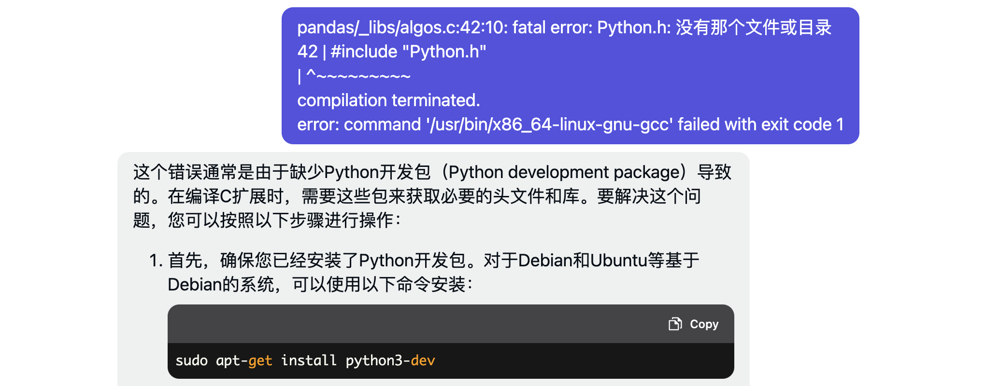
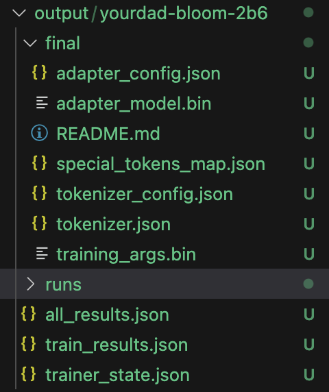

# 从入门到认爹 - 大模型单卡微调demo
> 1. 其实把全部环境打包成一个镜像就不用考虑环境问题了。但大模型开发依赖的环境并不算复杂，有Python虚拟环境的加持，从头开始弄问题不大。
> 2. 本文需要一定的python+计算机基础。

本文用来给对大模型感兴趣但又玩不太明白，手头又刚好有Linux系统和臭游戏卡的hxd，从环境配置->数据构造->微调->测试的手把手教学。

笔者环境为 Ubuntu 22.04 + CUDA 11.8 + RTX 4080 16G。~~华硕天选 + RGB 多给2G显存~~。
<!--  -->


# STEP1 环境准备

## 1. CUDA环境
1. 根据自己的linux版本，在[官网](https://developer.nvidia.com/cuda-11-8-0-download-archive?target_os=Linux&target_arch=x86_64&Distribution=Ubuntu&target_version=22.04&target_type=deb_local)中选择对应的CUDA安装。

## 2. 代码&模型环境
1. clone本代码库
```bash
git clone https://github.com/yangjianxin1/Firefly.git
```
2. 初始化一个Python3虚拟环境。此举是为了将环境隔离开，解决很多环境冲突的问题；同时用方便把环境打包为docker镜像，方便分发。
创建虚拟环境可以有多种方式，比如conda等，此处用python自带的venv。
```bash
python3 -m venv .firefly // 在当前目录下初始化名为.firefly的python3环境（也是一个文件夹），删除此文件夹即删除整个环境。
source .firefly/bin/activate // 激活此环境（就是把PYTHON相关路径都换到这个文件夹下）
```
3. 安装依赖。
```
cd Firefly
pip install -r requirements.txt
```
- 遇到报错（包括后面）先尝试看懂，一般都能用pip install解决。看不懂就贴给ChatGPT。比如笔者遇到过报错长这样。
```
pandas/_libs/algos.c:42:10: fatal error: Python.h: 没有那个文件或目录
42 | #include "Python.h"
| ^~~~~~~~~~
compilation terminated.
error: command '/usr/bin/x86_64-linux-gnu-gcc' failed with exit code 1
```
贴给ChatGPT后说

4. 模型准备。

笔者习惯去Huggingface把模型下载到本地，用其它方式当然也可以。本文所用的是[YeungNLP/firefly-bloom-2b6-v2](https://huggingface.co/YeungNLP/firefly-bloom-2b6-v2)
下载照着这个来

下载后，笔者将其存放在../models/firefly-bloom-2b6-sft-v2/ 这个位置。
> 通常，带有config.json和pytorch_model.bin的为完整模型目录，是可以直接加载使用的；带有adapter_config.json和adapter_model.bin的为lora参数，需要和完整模型一齐使用。

## 3. 训练集生成
> 本文只是demo，这里的数据可以任意构造，有conversation字段就行。
1. 在data目录下新建 your_dad.jsonl，并写入以下内容
```json
{"conversation_id": 1, "category": "Brainstorming", "conversation": [{"human": "你是谁？", "assistant": "我是你爹。"}], "dataset": "moss"}
```

## 4. 开始微调
1. 在train_args目录下新建 your-dad-alora.json，内容如下
```json
{
    "output_dir": "output/yourdad-bloom-2b6",
    "model_name_or_path": "../models/firefly-bloom-2b6-sft-v2/",
    "train_file": "./data/your_dad.jsonl",
    "num_train_epochs": 10,
    "per_device_train_batch_size": 1,
    "gradient_accumulation_steps": 1,
    "learning_rate": 2e-4,
    "max_seq_length": 900,
    "logging_steps": 1, // 设为1，看每一步的loss变化
    "save_steps": 500,
    "save_total_limit": 1,
    "lr_scheduler_type": "constant_with_warmup",
    "warmup_steps": 0, // 此处最好设为0，不然咱这总共就10步，还没warm起来就结束力。
    "lora_rank": 64,
    "lora_alpha": 16,
    "lora_dropout": 0.05,
    "max_memory_MB": 16000,

    "gradient_checkpointing": true,
    "disable_tqdm": false,
    "optim": "paged_adamw_32bit",
    "seed": 42,
    "fp16": true,
    "report_to": "tensorboard",
    "dataloader_num_workers": 0,
    "save_strategy": "steps",
    "weight_decay": 0,
    "max_grad_norm": 0.3,
    "remove_unused_columns": false
}
```
2. 使用qlora微调，节省显存。峰值显存占用6G左右。

3. 输出存放在 output/yourdad-bloom-2b6，其中final目录即为输出的lora参数。


## 5. 尝试一下
此处建议用peft直接加载完整模型和lora参数，省去merge（即把lora参数和完整模型融合，生成新的完整模型）的过程。峰值显存占用6G左右。
> 如果要merge，则需要先执行 script/merge_lora.py，并在下面的命令中将 --model_name 改为新输出的模型位置，且不再需要--adapter_name。
```bash
python3 script/chat/multi_chat.py --model_name ../models/firefly-bloom-2b6-sft-v2/ --adapter_name output/yourdad-bloom-2b6/final/ --max_memory_MB 16000

// max_memory_MB 根据自己实际情况设置。当模型超出显存时将放弃一部分隐变量存储，影响输出结果但防止爆显存。
```


作为参考，不经过微调的结果为
```bash
python3 script/chat/multi_chat.py --model_name ../models/firefly-bloom-2b6-sft-v2/
```

